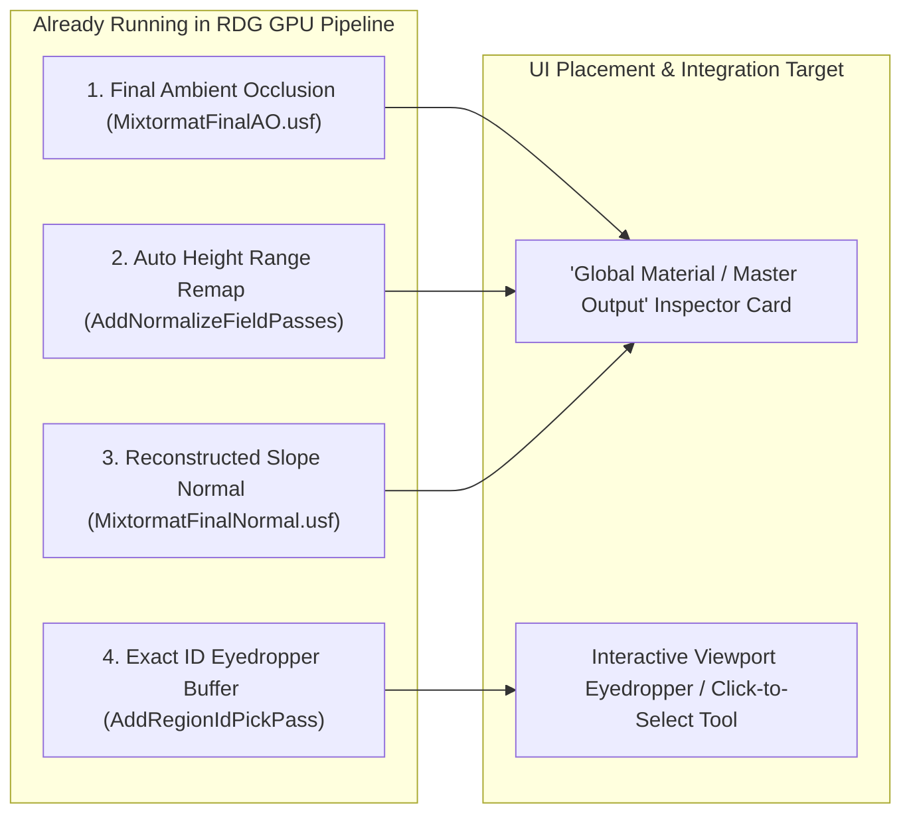
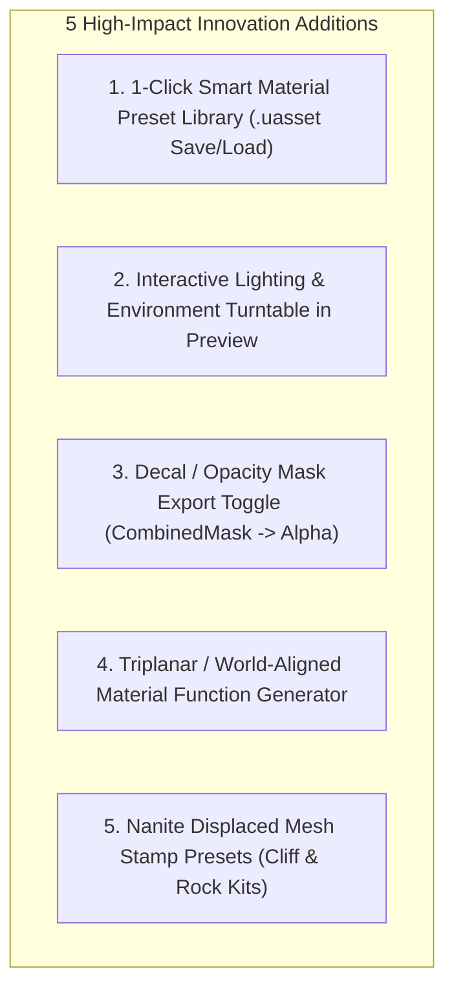

# Mixtormat — Hidden Capabilities & Commercial Power Features Roadmap

## 1. Executive Summary

This document details:
1. **The 4 Ready-to-Expose Backend Features**: Capabilities already fully compiled and executing in the RDG pipeline that merely lack dedicated, prominent Slate UI controls.
2. **5 High-Impact Commercial Innovation Ideas**: Low-to-medium effort features that bridge the gap between a standard material tool and a flagship, viral texturing suite on the Fab Store.

---

## 2. The 4 Ready-to-Expose Backend Features (Already Built in Shaders)

### 2.1 Final Ambient Occlusion (`MixtormatFinalAO.usf`)
- **Backend Reality**: Fully implemented in `FMixtormatFinalAOCS` (`MixtormatGpuComposePipeline.cpp`). Calculates screen-space and world-space ambient occlusion directly from the accumulated heightmap and injects it into the RAM texture.
- **UI Action Required**: Add a dedicated **Surface Ambient Occlusion** group (`AO Intensity` [0..1] and `AO Search Radius` [1..64px]) on the Master Output panel and Bake Dialog.
- **Artist Benefit**: Grounds layered crevices, cracks, and strata with realistic contact shadows with a single slider.

### 2.2 Auto Height Normalization (`bFinalAutoRemapHeight`)
- **Backend Reality**: Implemented via `AddNormalizeFieldPasses()`. Scans min/max bounds of the entire height stack on GPU and normalizes to a clean `[0.0, 1.0]` range.
- **UI Action Required**: Expose a toggle: `[x] Auto-Normalize Displacement Range` on the Global Settings card.
- **Artist Benefit**: Completely prevents clipped or washed-out heightmaps when stacking multiple generator and structural effect layers.

### 2.3 Reconstructed Tangent Slope Normals (`MixtormatFinalNormal.usf`)
- **Backend Reality**: Implemented via `FMixtormatFinalNormalCS`. Derives true physical geometric normals from the carved heightfield and blends micro-detail normal maps on top using Reoriented Normal Mapping (RNM).
- **UI Action Required**: Add a **"Height Normal Blend Strength"** slider [0.0 .. 2.0] in the Global Settings.
- **Artist Benefit**: Deep erosion grooves, stone fractures, and paint peeling edges automatically receive steep, realistic normal lighting without manual sculpting.

### 2.4 Viewport ID Eyedropper Picker (`AddRegionIdPickPass`)
- **Backend Reality**: Implemented via `AddRegionIdPickPass()`. Ping-pongs an integer pick buffer (`OutputRegionIdPick`) matching every pixel to its owning Region/Pattern/Cluster ID.
- **UI Action Required**: Add an **Eyedropper / Click-to-Pick tool** in `SMixtormatPreviewViewport` when a `Color ID`, `Random ID`, or `Ramp ID` child is active.
- **Artist Benefit**: Artists can click directly on a 3D brick, stone, or camouflage patch in the viewport to assign unique colors or wear properties.

---

## 3. High-Impact Commercial Innovation Ideas (For S-Tier Fab Polish)

### 3.1 One-Click "Smart Material" Preset Library
- **Concept**: Allow users to right-click any Layer or Layer Stack and click **"Export as Mixtormat Smart Material"**.
- **How it Works**: Serializes the `FMixtormatLayer` struct into a lightweight `.uasset` preset in the project's Content Browser.
- **Commercial Impact**: Creates an ecosystem where users and creators can share, save, and reuse custom material recipes (e.g. *Weathered Bronze*, *Desert Strata*, *Damaged Sci-Fi Paint*).

### 3.2 Viewport Lighting & HDRI Environment Turntables
- **Concept**: Add a quick toolbar at the top of `SMixtormatPreviewViewport`:
  - **Environment Presets**: *Studio Clean*, *Sunset Desert*, *Overcast Forest*, *Industrial Night*.
  - **Light Turntable**: Hold `Ctrl + Right Click` in the viewport to rotate the sunlight interactively.
- **Commercial Impact**: Allows artists to inspect roughness, metallic, normal tilt, and AO under various lighting conditions without leaving the editor.

### 3.3 PBR Decal / Opacity Mask Export Toggle
- **Concept**: In the Bake Dialog, add a checkbox: `[x] Export as PBR Decal (Include Opacity Mask)`.
- **How it Works**: Writes out the layer stack's `CombinedMask` (already computed on GPU) as an Alpha channel in BaseColor or as an independent `_Opacity.png` texture.
- **Commercial Impact**: Positions Mixtormat as a top-tier **In-Engine PBR Decal Maker** for blood stains, rust leaks, bullet cracks, and road markings.

### 3.4 Automated World-Aligned / Triplanar Material Generator
- **Concept**: In the Bake Dialog, add an option: `Target Material Type: [Standard PBR | Substrate Slab | Triplanar / World-Aligned]`.
- **How it Works**: Generates a material instance using UE's `WorldAlignedTexture` node, eliminating UV stretching on sheer cliffs and terrain slopes.
- **Commercial Impact**: Massive selling point for open-world and terrain artists.

### 3.5 Ready-to-Use Nanite Displaced Cliff & Terrain Meshes
- **Concept**: Include 3–5 low-poly modular cliff/rock meshes in `Content/Meshes/` designed to pair with Mixtormat's 32-bit height displacement.
- **Commercial Impact**: Gives users instant gratification when testing the plugin on actual 3D geometry in the showcase map.

---

## 4. Implementation Phasing & Timeline

| Feature | Phase | Effort | Files Involved |
|---|---|---|---|
| **Expose Final AO, Auto-Normalize & Slope Normal** | 1.0 Launch | ~2 Hours | `MixtormatInspectorGenerators.cpp`, `MixtormatBakeDialog.cpp` |
| **Viewport ID Eyedropper Tool** | 1.0 Launch | ~3 Hours | `SMixtormatPreviewViewport.cpp`, `MixtormatInspectorIds.cpp` |
| **PBR Decal Export Toggle** | 1.1 Update | ~2 Hours | `MixtormatBakePipeline.cpp`, `MixtormatBakeDialog.cpp` |
| **Smart Material Preset Exporter** | 1.1 Update | ~4 Hours | `MixtormatEditorModule.cpp`, `MixtormatAssetActions.cpp` |
| **HDRI Viewport Turntable** | 1.2 Update | ~3 Hours | `SMixtormatPreviewViewport.cpp`, `MixtormatPreviewSceneSettings.h` |
