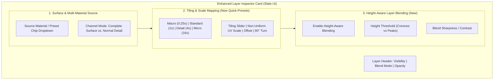
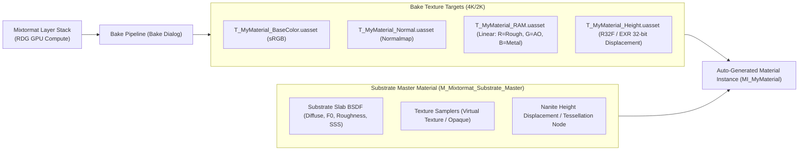

# Mixtormat — Multi-Material Layering, UI Workflow & Substrate Integration Plan

## 1. Executive Summary

This plan outlines the implementation strategy for enhancing **Mixtormat's Multi-Material Layering UX** (including independent layer tiling, macro/micro scale blending, and height-aware transitions) along with the **Automated Unreal Engine 5.8 Substrate Master Material Generator & Texture Baker**.

---

## 2. Layer & Multi-Material UI Workflow Enhancements

### 2.1 Current Architecture vs. New UX Additions
The runtime data model (`FMixtormatLayer` in `MixtormatLayerTypes.h`) already supports:
- Independent `Tiling`, `UVScaleX`, `UVScaleY`, `UVOffsetX`, `UVOffsetY`, `Rotation`, `bFlipU`, `bFlipV`.
- 20 Color Blend Modes (`EMixtormatColorBlendMode`).
- Complete Surface / Material stacking (`SourceSurface`, `SourceComposition`).

### 2.2 UI Implementation Details in Slate (`MixtormatEditor`)

1. **Quick Tiling Preset Bar** (`Source/MixtormatEditor/Private/Widgets/Inspector/MixtormatInspectorLayers.cpp`):
   - Add a compact segmented button bar on the Layer Card: `Macro (0.2x)` | `Base (1x)` | `Detail (4x)` | `Micro (16x)` | `Custom`.
   - Clicking sets `FMixtormatLayer::Tiling` instantly with automatic live viewport update.

2. **Height-Aware Crevice Blending Controls**:
   - Expose `HeightBlendMode` directly on the Layer Blend card.
   - When enabled, blends the upper layer into the underlying surface's height valleys first (e.g. mud filling stone cracks before covering rock faces).

---

## 3. Substrate Master Material & Automated Baker Architecture

Unreal Engine 5.8 uses the **Substrate material framework** (slab-based physical shading). Mixtormat will provide a seamless 1-click pipeline from layered authoring to native Substrate materials.

---

## 4. Substrate Master Material Technical Specification

### 4.1 Master Material Layout (`M_Mixtormat_Substrate_Master`)
Located in `Content/Materials/M_Mixtormat_Substrate_Master.uasset`:

1. **Substrate Slab BSDF**:
   - **Base Color**: `TextureParameterValue('BaseColor')`
   - **Roughness**: `ComponentMask(R)` of `TextureParameterValue('RAM')`
   - **Ambient Occlusion**: `ComponentMask(G)` of `TextureParameterValue('RAM')`
   - **Metallic**: `ComponentMask(B)` of `TextureParameterValue('RAM')`
   - **Normal**: `TextureParameterValue('Normal')` (Tangent Space)
   - **Specular / F0**: Reflected from `FMixtormatLayer::IOR`

2. **Nanite Displacement & Tessellation Section**:
   - **Displacement Input**: Connected to `TextureParameterValue('Height')` (`PF_R32_FLOAT`).
   - Includes parameters for `Displacement_Magnitude`, `Displacement_Center (0.5)`, and `Displacement_Falloff`.

3. **Runtime Virtual Texture (RVT) Switch (Optional)**:
   - Switch parameter `bEnableRVTSupport` for landscape and open-world terrain blending.

---

## 5. Automated 1-Click Material Instance Creation (`MixtormatEditor`)

When the user clicks **"Bake & Create Substrate Material"** in the Mixtormat Bake Dialog:

1. **Bake Pass Execution**:
   - Executes RDG gather passes for BaseColor, Normal, RAM, and Height.
   - Saves 4 `.uasset` textures in the project directory using Unreal's `FAssetRegistryModule` and `FTextureEditorToolkit`.

2. **Automated Material Instance Generation**:
   - Spawns a new `UMaterialInstanceConstant` parented to `M_Mixtormat_Substrate_Master`.
   - Populates texture parameters automatically:
     - `SetTextureParameterValueEditorOnly(TEXT("BaseColor"), BakedBaseColor)`
     - `SetTextureParameterValueEditorOnly(TEXT("Normal"), BakedNormal)`
     - `SetTextureParameterValueEditorOnly(TEXT("RAM"), BakedRAM)`
     - `SetTextureParameterValueEditorOnly(TEXT("Height"), BakedHeight)`
   - Saves the Material Instance asset and highlights it in the Content Browser.

---

## 6. Implementation Checklist & Phasing

| Phase | Task | Files Involved |
|---|---|---|
| **Phase 1: UI Polish** | Add Quick-Tiling Presets (Macro, Base, Detail, Micro) to Layer Card. | `MixtormatInspectorLayers.cpp`, `MixtormatLayerTypes.h` |
| **Phase 2: Height Blending** | Wire `HeightBlendMode` contrast slider into `AddLayerCompositePass`. | `MixtormatGpuComposePipeline.cpp`, `MixtormatCompose.usf` |
| **Phase 3: Substrate Master** | Build `M_Mixtormat_Substrate_Master` with Substrate Slab & Nanite Displacement. | `Content/Materials/M_Mixtormat_Substrate_Master.uasset` |
| **Phase 4: 1-Click Instancing** | Hook up `UMaterialInstanceConstant` auto-creator in Bake pipeline. | `MixtormatBakeDialog.cpp`, `MixtormatBakePipeline.cpp` |
