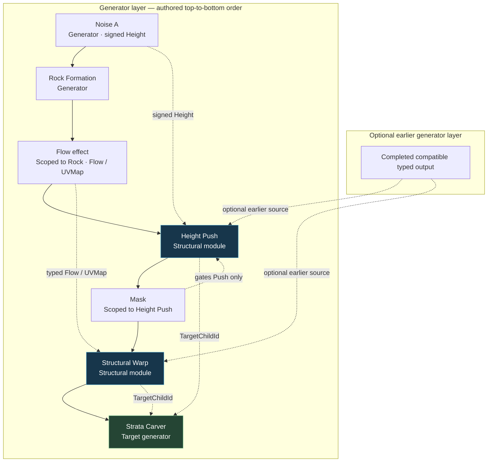
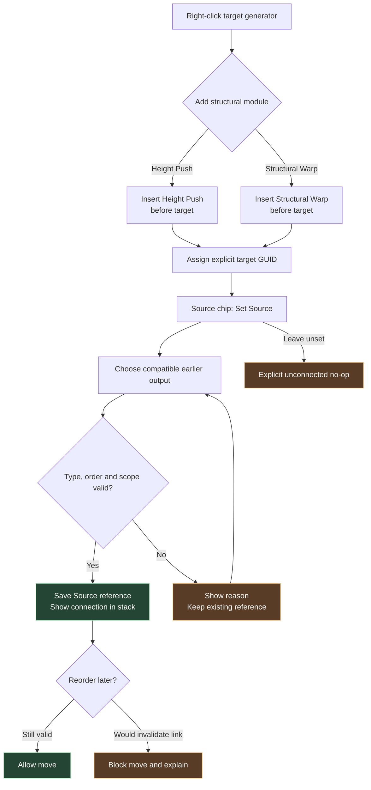
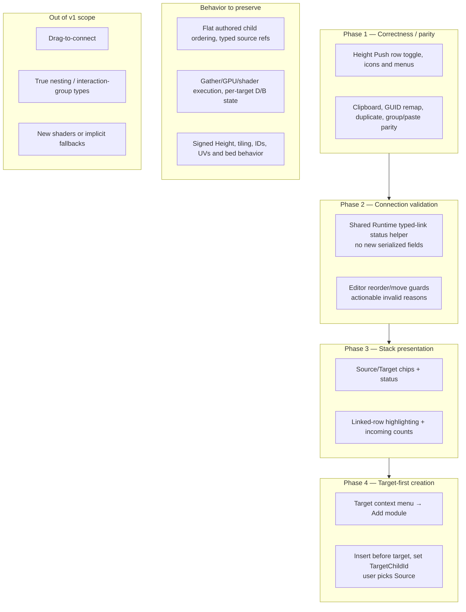

# Mixtormat — Height Push / Structural Warp UX (Proposal)

**Status:** Proposed v1, not implemented. Based on the combined audits of the `main` source at `0e8b6cf`. Preserve Runtime → Shaders → Editor ownership, existing serialized reference types and authored order. No implicit source/target fallback.

## 1. Scope and authored order

Solid arrows indicate one *example* flat child order. Dashed arrows indicate reference or mask relationships. Push and Warp may be reordered deliberately; their composition is not commutative.

**Rules:** Source must evaluate earlier. Height Push consumes completed `ScalarSigned` Height from an eligible generator and targets later unscoped **Strata Carver only** in its same layer. Structural Warp consumes `Flow` or `UVMap` from a compatible earlier completed scoped effect and targets a later enabled unscoped generator in the same layer. Earlier-layer source references are permitted when valid. Scoped masks remain beneath and gate their interaction module; the module itself is **not** nested under the target.

## 2. Target-first user flow

**UI:** Compact collapsed rows show `Source · Output → Target`; selected interaction module expands to show chips and main parameter. Target generator shows derived incoming count (`1 PUSH · 1 WARP`). Continue showing existing inspector controls for the first release. Chip menus use the same validation as Inspector.

## 3. Scope and implementation ownership

| Ownership | Proposed scope |
|---|---|
| **Runtime** | Reuse source/target reference model; add small read-only validation/status resolver (and any confirmed identity remap parity fix). No serialization/schema changes. |
| **Editor** | Fix parity + clipboard; update hierarchy rows/badges/chips, connector highlighting, inspector menu reuse, target-first creation, reorder guards. |
| **Gather/GPU/Shaders** | Preserve evaluation, source completion/demand, per-target signed bedding/warp fields and coordinate contracts; no algorithm changes. |

### Validity feedback

- **Valid** — resolved typed Source and later Target.
- **Unset** — explicit no-op; never guess a source.
- **Disabled** — preserved connection while module or dependency is off.
- **Missing** — stale or absent GUID; show reason.
- **Wrong type or scope** — rejected with reason.
- **Forward-order** — source not completed earlier, or target not later; prevent invalid reorder by default.
- **Neutral value** — valid but current amount makes no effect.
- **Cyclic** — not a normal stored state in the current strictly ordered structural-module model; do not introduce a generic cycle badge.

### Approval boundaries

1. **First release:** phases 1–4 above.
2. **Validation:** share actual Runtime predicates between gather and editor where possible; do not duplicate rules that may drift.
3. **Keep Inspector:** mirror current controls until inline source/target selection is proven.
4. **Later:** source-to-target drag menu and optional connector lines, without changing authored order.
5. **Not approved:** real target nesting, new interaction groups, implicit auto-source, changing signed height / UV / IDs / tiling or shader behavior.
