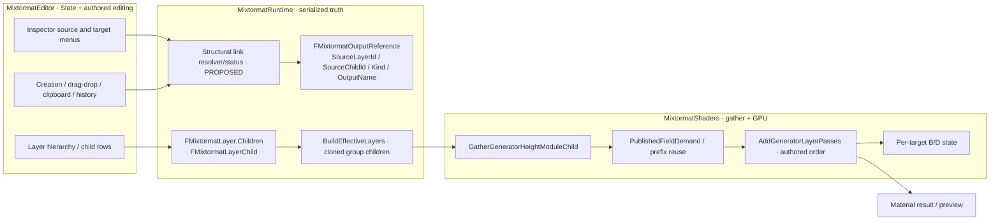
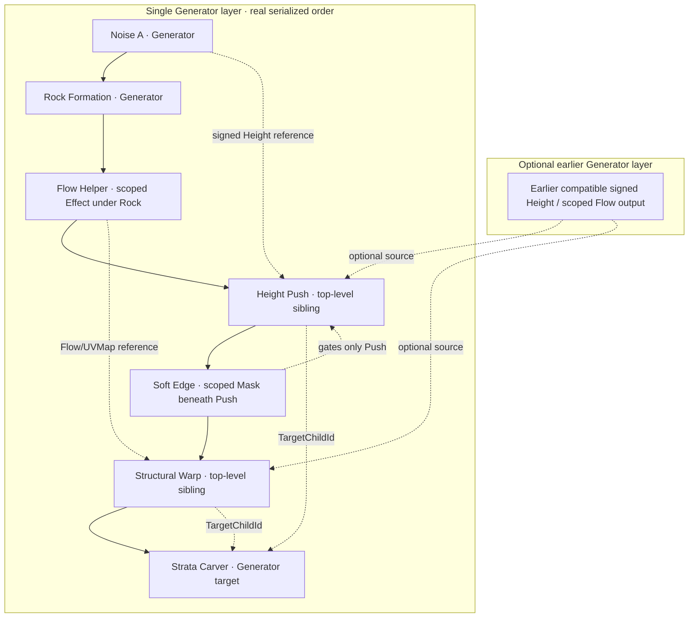
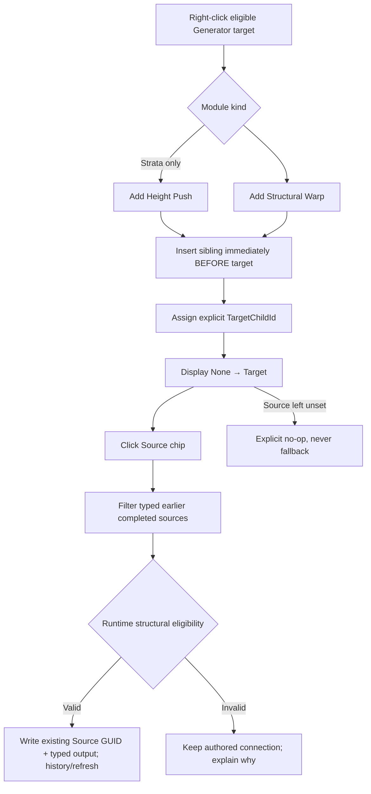
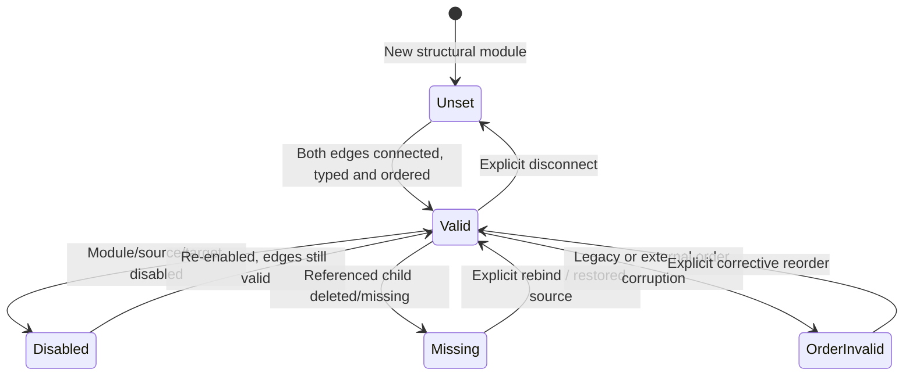
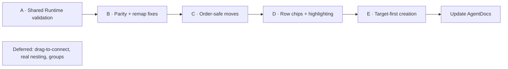

# Mixtormat — Height Push / Structural Warp Interaction UX

**Implementation specification · proposed v1 · read-only plan**  
**Basis:** seven independent review streams (own audit, Grok, Sonnet, DeepSeek, GLM, Mistral, Qwen), the approved layer-stack visual, and direct source inspection of `hugobeyer/matlab` default branch on **2026-10-07**. The audit set names commit `0e8b6cfc89c5fdfca2c35abb99dc239d2c66b4f9`; exact line positions should be rechecked against the agent's checkout before edits.  
**Repository:** <https://github.com/hugobeyer/matlab>  
**Status:** original architecture/UX proposal retained below; implementation has progressed.

### Current-state overlay — 2026-10-08

The original proposal is not a current completion checklist. The consolidated source audit
and targeted local reads support the following status; builds and runtime behavior are unverified.

| Phase | Source-level status | Remaining work |
| --- | --- | --- |
| A — Runtime link status/predicates | Shared structural status and eligibility exist | Runtime acceptance |
| B — Push parity/identity | Clipboard remapping and procedural-row paths reported implemented | Group-shared Push compatibility decision |
| C — Order-safe moves | Guards for previously valid links reported implemented | Runtime gesture acceptance |
| D — Connection UI | Row chips, highlighting, incoming counts and shared menus exist | Inspector caching, count edge policy and proposed hierarchy indentation |
| E — Target-first creation | Explicit target GUID; source left unset; insertion before target | Runtime workflow acceptance |

**Hierarchy indentation remains unimplemented:** structural reference edges do not reparent
modules or alter flat execution order. Retain the proposal below for that outstanding work.
See `code_docs/consolidated_audit_remediation_plan.md` for the follow-up scope and approval gates.

> **One decision:** Retain the canonical flat `Layer.Children` order. Make Height Push and Structural Warp connections visible and editable in the layer stack; implement target-first creation. Before UI work, centralize structural-link validation and repair confirmed Height Push identity/hierarchy defects. No shader, GPU, serialization or geology changes.

---

## 0. Agent contract and non-goals

**Read in order:** `AGENTS.md` → `AgentDocs/GENERATORS.md` → `AgentDocs/UI.md` → `AgentDocs/SHADERS.md` → `AgentDocs/code_docs/strata_structural_warp_design.md` → `AgentDocs/code_docs/generator_warp_output_alignment_design.md`. Use `AgentDocs/ARCHITECTURE.md` and `AgentDocs/FILE_MAP.md` for navigation. The implementation and current source override historical proposals.

**Follow repo constraints:** one-way **Runtime ← Shaders ← Editor**; serialized enums append-only; no removal of existing public APIs, payloads, legacy sockets, params or compatibility paths; theme through `MixtormatDesignTokens`/`MixtormatThemeStore`, no ad hoc Slate styling. Per current `AGENTS.md`, **do not add or run tests/diagnostics/automated validation; builds and Unreal launches require explicit user consent; tests require explicit consent.** The checklists below are prospective review/acceptance cases, not permission to run them.

**In v1:** structured link-status query; Height Push correctness parity; move/reorder guards; compact row chips and link highlighting; derived incoming counts; target-first creation; retained Inspector controls. **Out of v1:** real target parenting, new interaction-group types, drag-to-connect, permanent connector lines, node editor, generic generator Flow sources, new source/target auto-fallback, composition algorithm changes, new output capabilities, shader work, UI-wide redesign, icon pipeline migration.

**Approved interaction rules:** flat ordered siblings; structural module physically before explicit target; source independently and explicitly chosen; source/target link stored in existing GUID fields; mask scoped to module; no green success badge spam; neutral numeric values shown in Inspector, not as a stack error; failed reorder never silently rewrites GUIDs. An invalid *saved* link remains visible with a reason, not auto-fixed.

### Priority notation

- **P0 correctness:** missing state or identity handling can silently change behavior or leave UI inert.
- **P1 user experience:** needed for complete v1 workflow.
- **P2 polish/future:** not a condition for shipping.
- **Verified source:** checked in repository file, symbol and implementation; runtime failure not claimed unless explicitly confirmed.
- **Proposal:** new function/API/behavior described for agents to implement, not a current symbol.

---

## 1. Architectural map: what exists and must survive

### 1.1 Ownership and execution



The **module** (not its target) owns the serialized socket: `FMixtormatLayerChild.Type == HeightPush|StructuralWarp`; payload contains `bool bEnabled`, `FMixtormatOutputReference Source`, and `FGuid TargetChildId`. Source is a typed published output; target is an **existing later child in the same Generator layer**, not a synthetic scope owner. Target-child IDs and source-child IDs must survive asset saves, duplication and remapping. `ScopeOwnerChildId` is reserved for real scoped children such as a mask **under the structural module**, never for parenting the structural module to its target.

### 1.2 Reference rules — source-verified, not generalized

| Contract | Height Push | Structural Warp |
|---|---|---|
| Source | Enabled, unscoped **Generator** child with completed signed `ScalarSigned/Height` | Enabled **Effect** child scoped under an enabled, unscoped flow-capable Generator, with typed `Flow/FlowDirection` or `UVMap/WarpedUV`; generic `Vector2` rejected |
| Source locality | Earlier child in same layer **or** an eligible earlier Generator layer | Same; for same layer, owning generator's **entire scope** must have finished before Warp module |
| Target | Later, enabled, unscoped **StrataCarver** only; same Generator layer | Later, enabled, unscoped **any current generator type**; same Generator layer |
| Masks | Scoped mask children gated by `ScopeOwnerChildId == Module.ChildId` | Same |
| State | Accumulates signed bedding coordinate shift `B`, not layer running height | Accumulates per-target displacement `D` and transports earlier bedding shift `B` |
| Unsupported | Non-Strata target; generic height texture, output aliases, implicit target, target in earlier/other layer | Unscoped Flow/UV generator outputs, Noise Gradient `Vector2`, incomplete flow-owner scope, cross-layer target |

**Important corrections to external audits:** Some reports assumed Warp can directly read a generator's Flow/UV output; current `ResolveGeneratorInputSource` explicitly accepts an `Effect` scoped under a flow-capable generator for Flow/UV. Mistral and Qwen described true target nesting as current or trivial; it is neither. “Cyclic” is not a normal stored structural link state: strictly-earlier source and later target give a forward-order violation before a structural cycle can exist. Generic output-reference/other systems have separate dependency rules; do **not** replace their validator.

Runtime symbols: `Source/MixtormatRuntime/Public/MixtormatLayerTypes.h` (`EMixtormatLayerChildType`, `FMixtormatLayerChild`, `FMixtormatLayer`), `.../MixtormatGeneratorTypes.h` (`FMixtormatGeneratorHeightPush`, `FMixtormatGeneratorStructuralWarp`, `MixtormatCanOwnGeneratorFlow`), `.../MixtormatOutputReference.h/.cpp` (`ResolveGeneratorInputSource`, `ResolveStructuralWarpTarget`), `.../MixtormatChildScope.h/.cpp` (`ResolveOwnerIndex`, `CanOwnScopedMasks`).

### 1.3 Real order versus visual reference edges



Solid arrows are **one example** of authored child sequence (not literal GPU shader connections). Dashed arrows denote serialized refs or scoping. Push → Warp differs from Warp → Push; moving these two intentionally within valid bounds must remain possible. Scoped-mask children are included in the contiguous subtree when inserting/reordering their owner.

### 1.4 GPU and shader freeze line

Gather: `Source/MixtormatShaders/Private/Compositing/MixtormatGeneratorGather.cpp::GatherGeneratorHeightModuleChild` (Push currently checks target inline, Warp calls Runtime resolver). Composer: `.../MixtormatGpuCompositor.cpp::RequestComposeInternal` builds/uses effective layers and invokes gather; `.../MixtormatGpuComposePipeline.cpp::EnqueueCompose` registers demanded `HeightPush.Source` and `StructuralWarp.Source` before prefix-cache reuse (around existing lines 690–705). GPU: `.../MixtormatGpuGeneratorPasses.cpp::AddGeneratorLayerPasses` walks children in authored order, uses `GeneratorHeightPushFields` (`PF_R32_FLOAT`) and `GeneratorStructuralDisplacements` (`PF_G32R32F`) keyed by **target child index**, checks published field kind, completeness and matching texture extent. Shaders: `Shaders/Private/MixtormatGeneratorHeightPush.usf`, `MixtormatGeneratorStructuralWarp.usf`, `MixtormatStrataCarver.usf`, `MixtormatGeneratorWarp.ush`, `MixtormatGeneratorHeightModules.ush` are **read-only boundaries for v1**.

Never reinterpret `FMixtormatGenerator.HeightSource` or `.WarpSource`: those are legacy serialized generator-level sockets, disabled by default; they are not the ordered modules. Never silently coerce `Vector2` to Flow. Never alter signed Height, per-target B/D ordering, placement, periodic tiling, UV winding, ID/region random, bed position/random, boundary validity, Jacobian/gradient behavior or completed-bundle remap.

---

## 2. Existing UX, source locations and defect ledger

| ID | Severity | Existing owner / function | Source-confirmed issue | Required result |
|---|---|---|---|---|
| D01 | **P0** | `Widgets/Layers/MixtormatLayerHierarchy.cpp`, procedural-row `bGenerated` decision (~1064–1090) | `StructuralWarp` listed, `HeightPush` absent; row toggle/context dispatch takes the Mask path | Add HeightPush to procedural-row classification; row enable toggles `HeightPush.bEnabled`; contextual actions correct |
| D02 | **P0** | `Widgets/Layers/MixtormatLayerHierarchy.cpp::MakeChildTypeIcon` (~23–52) | Warp generator glyph, Push falls to Mask glyph | Put both structural types in intended generator/module icon path; use existing icon registry |
| D03 | **P0** | `Widgets/Layers/MixtormatLayerMenus.cpp::BuildGeneratedContextMenu` (~1350–1485) | `bFilter` and remove-label switch include Warp but omit Push | Push gets no Blend Mode menu and correct `Remove Height Push` label |
| D04 | **P0** | `Widgets/Layers/MixtormatLayerClipboard.cpp::CopyChildSubtree` (~15–60), `ResolvePasteInsertIndex` (~190–220) | Internal reference remap and generator-layer paste gate cover Warp, not Push | Remap Push Source and Target and apply equivalent valid-placement rule |
| D05 | **P0** | `Runtime/Private/MixtormatParameterBinding.cpp` (~665–710, 770–790, 1108–1170) | Duplicate-layer, regenerate identities, moved-child parent remap handle Warp Source/Target, omit Push | Full Push parity for relevant identity paths without touching unrelated fields |
| D06 | **P0 — compatibility decision** | `Runtime/Private/MixtormatLayerGroups.cpp::BuildEffectiveLayers` (~232–340) | Warp group clone forced disabled; Push not; source remap has Warp case only | Preserve group policy explicitly; gate shared Push like shared Warp or support with verified behavior **only by approval** |
| D07 | **P0** | `Widgets/Layers/MixtormatLayerActions.cpp::CreateChild` (~1428–1500), `Widgets/Layers/MixtormatLayerDragDrop.cpp::MoveChildToLayer/MoveChildToGroup` (~623–740) | Generator-module placement guards mention Warp but not Push; `CreateChild` excludes Push from general gate | Add Push to same legal container rules; do not create modules on non-Generator layers/groups |
| D08 | **P0** | `Widgets/Layers/MixtormatLayerChildren.cpp::GetPublishedOutputSource` (~257–281), `PublishedOutputPlacementsValid` (~509–538); `Widgets/Layers/MixtormatLayerDragDrop.cpp::CanMovePublishedOutputs` (~762–826) | Current projection validation enumerates generic published-output edges, **not structural Source/Target GUID relationships** | Structural-aware check of proposed order, including both incoming and outgoing links; block formerly valid → invalid moves with reason |
| D09 | P1 | `Widgets/Inspector/MixtormatInspectorGenerators.cpp::BuildHeightPushConnectionMenu/Controls` (~762–879), `BuildStructuralWarpConnectionMenu/Controls` (~880–1037) | Two independent dropdowns; invalid entries only `.Enabled(false)`; chip labels `None`/`Unavailable`/name | Shared validity, contextual disabled reasons, existing Inspector retained |
| D10 | P1 | `UI/Layers/SMixtormatLayerChildRow.h/.cpp`, `Widgets/Layers/MixtormatLayerHierarchy.cpp` | Row has `Name`, `Kind`, `Badge` slots but **no link-chip slot**; row height token fixed | Add structural-only, width-adaptive compact link presentation without changing other rows |
| D11 | P1 | `Widgets/Layers/MixtormatLayerHierarchy.cpp::IsSourceOfSelectedInstance`, `.bInstanceSource` | Existing highlight only for instance/output reference source; no structural source-versus-target roles | Transient role-aware linked row styling without repurposing instance link semantics |
| D12 | P1 | `Widgets/Layers/MixtormatLayerMenus.cpp` generator context builders, `Widgets/Layers/MixtormatLayerActions.cpp::CreateChild` | Existing Add Height Push/Warp creates via layer append; no target-context prewire | Add explicit target-context action, safe pre-target insertion and target GUID assignment; no source guessing |
| D13 | P1 | `Widgets/MixtormatChildCapabilities.cpp::GetChildCapabilities` (~145–360) | Generator completed signed `Height` is **not declared as copyable capability**; inspector Push menu synthesizes its address | Keep existing synthetic signed `Height` handling for v1; don't promote a new globally copyable output as collateral work |
| D14 | P1 | `Widgets/Layers/MixtormatLayerActions.cpp::CreateChild` comment and Inspector menu lambdas | Existing layer child creation / link assignment may not record history or set dirty via uniform edit path; group path differs | Inspect existing history expectations; make **new target-first and new chip mutations** atomic and undo/dirty coherent; avoid unrelated undo rewrite |
| D15 | P1 | UI candidate lists from `WorkingLayers`, gather from expanded `EffectiveLayers` | Group expansion can alter address/eligibility; a label may resolve while composed effective source fails | Query effective projection appropriately and label authored addresses; treat group limitations explicitly |

**Evidence qualification:** The omissions and code paths above are directly visible in source, but their **observed behavior in Unreal has not been run here**. A missing branch does not alone prove every reported end-user symptom. Connection edit undo/dirty behavior specifically requires inspection of `RefreshLayeredPreview`/history orchestration before claiming a bug. D06 must not be “fixed” by silently changing published render behavior on legacy assets.

### Source ownership index (repository-root-relative)

| Layer | File | Verified entry points / work |
|---|---|---|
| Runtime | `Source/MixtormatRuntime/Public/MixtormatLayerTypes.h` | `EMixtormatLayerChildType`, `FMixtormatLayerChild::ScopeOwnerChildId`, `.HeightPush`, `.StructuralWarp`, `FMixtormatLayer::Children` (do not change layout) |
| Runtime | `Source/MixtormatRuntime/Public/MixtormatGeneratorTypes.h` | `FMixtormatGeneratorHeightPush`, `FMixtormatGeneratorStructuralWarp`, `MixtormatCanOwnGeneratorFlow` (do not change payload) |
| Runtime | `Source/MixtormatRuntime/Public/MixtormatOutputReference.h` | `FMixtormatOutputReference`, `MixtormatOutputReferences::*`; **proposed** read-only status interface |
| Runtime | `Source/MixtormatRuntime/Private/MixtormatOutputReference.cpp` | `ResolveGeneratorInputSource` (~295), `ResolveStructuralWarpTarget` (~405); existing semantics for shared predicates |
| Runtime | `Source/MixtormatRuntime/Private/MixtormatParameterBinding.cpp` | duplicate-layer remap, `RegenerateLayerIdentities`, `RegenerateChildIdentity`, `RemapChildParent` |
| Runtime | `Source/MixtormatRuntime/Private/MixtormatLayerGroups.cpp` | `BuildEffectiveLayers`, cloned child Source remap and gating |
| Runtime | `Source/MixtormatRuntime/Private/MixtormatChildScope.cpp` | `ResolveOwnerIndex`, `CanOwnScopedMasks`, `SanitizeStaleOwners` |
| Editor | `Source/MixtormatEditor/Private/Widgets/Inspector/MixtormatInspectorGenerators.cpp` | four `BuildHeightPush*`/`BuildStructuralWarp*` controls and menus |
| Editor | `Source/MixtormatEditor/Private/Widgets/Layers/MixtormatLayerHierarchy.cpp` | row assembly, `bGenerated`, `MakeChildTypeIcon`, `IsSourceOfSelectedInstance`, `.bInstanceSource` |
| Editor | `Source/MixtormatEditor/Private/UI/Layers/SMixtormatLayerChildRow.h/.cpp` | Slate args, horizontal slot layout, `OnMouseButtonDown`, menu anchor; add structural slot and event routing |
| Editor | `Source/MixtormatEditor/Private/UI/Layers/MixtormatLayerBadges.cpp` | `ForChild`, `KindForChild`; avoid permanent success badge clutter |
| Editor | `Source/MixtormatEditor/Private/Widgets/Layers/MixtormatLayerChildren.cpp` | `IsChildEnabled`, `SetChildEnabled`, `GetPublishedOutputSource`, `PublishedOutputPlacementsValid`, `FindSubtreeEnd`, `CanAddScopedChild`, `ApplyChildCreationDefaults` |
| Editor | `Source/MixtormatEditor/Private/Widgets/Layers/MixtormatLayerDragDrop.cpp` | `ReorderLayerChild`, `MoveChildToLayer`, `MoveChildToGroup`, `CanMovePublishedOutputs`, `CanDropChildIntoIdGroup` |
| Editor | `Source/MixtormatEditor/Private/Widgets/Layers/MixtormatLayerClipboard.cpp` | `CopyChildSubtree`, `ResolvePasteInsertIndex`, copy/paste address handling |
| Editor | `Source/MixtormatEditor/Private/Widgets/Layers/MixtormatLayerActions.cpp` | `CreateChild`, selection, `RecordEditHistory`, `RefreshLayeredPreview`/`RebuildLayerList` calls |
| Editor | `Source/MixtormatEditor/Private/Widgets/Layers/MixtormatLayerMenus.cpp` | `AddCreationSections`, `BuildGeneratedContextMenu`, target's generator context route |
| Editor | `Source/MixtormatEditor/Private/Widgets/MixtormatChildCapabilities.cpp` | `GetChildCapabilities`, typed Flow/UVMap outputs, Noise Gradient stays Vector2 |
| Editor | `Source/MixtormatEditor/Private/Widgets/SMixtormat.h` | member declarations, selection/address/edit state; add proposed helper declarations sparingly |
| Editor | `Source/MixtormatEditor/Private/Widgets/Layers/MixtormatLayersPrivate.h` | private utilities; inspect for best home for shared editor adapter |
| Editor | `Source/MixtormatEditor/Private/UI/Atoms/SMixtormatChip.*`, `UI/Rows/SMixtormatRow.*` | reuse existing controls; don't duplicate menu behaviors |
| Editor | `Source/MixtormatEditor/Private/Style/MixtormatDesignTokens.h`, `MixtormatThemeStore.*` | row spacing, narrow truncation, status palette roles |
| Shaders | `Source/MixtormatShaders/Private/Compositing/MixtormatGeneratorGather.cpp` | `GatherGeneratorHeightModuleChild`, Push target inline check vs Warp resolver; **small resolver unification allowed**, no changed resulting render data |
| Shaders | `Source/MixtormatShaders/Private/MixtormatGpuComposePipeline.cpp` | `EnqueueCompose`, published source demand; preserve |
| Shaders | `Source/MixtormatShaders/Private/MixtormatGpuGeneratorPasses.cpp` | `AddGeneratorLayerPasses`, `GeneratorHeightPushFields`, `GeneratorStructuralDisplacements`; preserve |
| Shaders | `Source/MixtormatShaders/Private/MixtormatGpuCompositor.cpp` | gather from effective layers and compose dispatch; preserve |

---

## 3. Phase A — Runtime link status and predicate unification (P0; FIRST)

**Objective:** one explicit, read-only description of a structural module's **source** and **target** validity, reusing current predicates so the Gather and Editor don't drift. **No new USTRUCT/UPROPERTY, enum appended to serialized taxonomies, persistent status or Slate dependency.** A plain C++ non-reflected enum/struct in Runtime is suitable.

### 3.1 Proposed API (conceptual; names may be adjusted to repository conventions)

Place declarations near `MixtormatOutputReferences` in `Source/MixtormatRuntime/Public/MixtormatOutputReference.h`; implementation in `Private/MixtormatOutputReference.cpp`. Example—not a drop-in patch:

```cpp
// Ordinary non-serialized C++ only; not a UENUM / UPROPERTY.
enum class EStructuralLinkIssue : uint8
{
    None, Unset, MissingLayer, MissingChild, DuplicateIdentity,
    DisabledLayer, DisabledModule, DisabledSource, DisabledTarget,
    WrongOwnerLayer, WrongSourceKind, WrongSourceScope, IncompleteSourceScope,
    ForwardSource, ForwardTarget, WrongTargetKind, ScopedModule, ScopedTarget,
    UnsupportedGroupPlacement, UnavailableEffectAsset
};

struct FStructuralEdgeStatus
{
    EStructuralLinkIssue Issue = EStructuralLinkIssue::Unset;
    int32 LayerIndex = INDEX_NONE;
    int32 ChildIndex = INDEX_NONE;
};

struct FStructuralLinkStatus
{
    FStructuralEdgeStatus Source;
    FStructuralEdgeStatus Target;
    bool bModuleEnabled = false;
    bool bCanExecuteStructurally = false; // NOT a guarantee that GPU texture exists
};

// Proposal should accept optional candidate overrides for menu and projected-order checks.
FStructuralLinkStatus EvaluateStructuralLink(
    const TArray<FMixtormatLayer>& EffectiveLayers,
    int32 ModuleLayerIndex, int32 ModuleChildIndex,
    const FMixtormatOutputReference* ProposedSource = nullptr,
    const FGuid* ProposedTarget = nullptr);

int32 ResolveHeightPushTarget(
    const TArray<FMixtormatLayer>& EffectiveLayers,
    int32 ModuleLayerIndex, int32 ModuleChildIndex, const FGuid& TargetChildId);
```

**Do not over-engineer the enum**: implement only distinguishable statuses the actual source parser can identify. If an issue cannot be reliably distinguished, return a narrow `InvalidSource` plus a safe generic reason; do not mislabel stale GUID as “Wrong Type.” The example is a design shape, not a requirement to ship all enum members.

### 3.2 Predicate mechanics

1. Resolve the **authored module identity** (`LayerId`, `ChildId`) to a unique child in **effective layer projection**. Check layer type, module type, `ScopeOwnerChildId`, module-enabled and group policy distinctly.
2. Evaluate each edge **independently** so a disabled module can retain readable/repairable configured connections. Existing `ResolveGeneratorInputSource` returns `INDEX_NONE` early for disabled modules; avoid using only its binary return as the whole status.
3. Source typed identity: Height is exactly `ScalarSigned` + `Height`; Warp is exact canonical `Flow` or `UVMap`. Resolve original source `LayerId`, `ChildId`, kind and output; validate source enabled/owner effect scoping and same-layer complete scope. Do not grant arbitrary generator Flow/UV rights or accept Noise `Gradient`.
4. Target identity: exact later same-layer, enabled, unscoped generator; for Push, Strata only; for Warp, any generator type supported by current resolver. Check missing separately from wrong order and disabled.
5. Extract the **Push target** loop currently inside `GatherGeneratorHeightModuleChild` into `ResolveHeightPushTarget`, sharing its exact predicate with editor menus. Keep existing public `ResolveGeneratorInputSource` and `ResolveStructuralWarpTarget` call signatures compatible (thin wrappers or shared private predicate); compare old/new rejection conditions line by line.
6. `LOCTEXT` reason, remediation and inaccessible-selection tooltips belong in **Editor**, mapped from status codes (`Source must be earlier`, `Source scope is unfinished`, `Target must follow module`, `Height Push requires Strata`, etc.). Runtime never imports Slate or localizable UI strings.
7. One pure call supports a **proposed Source or Target** without mutating `WorkingLayers`. Editing a disabled module must not toggle `bEnabled` merely to populate the menu. Candidate evaluation distinguishes “structurally connectable when enabled” from “currently inactive.”
8. **GPU availability is separate:** `IsComplete`, texture extent, demand, cache generation and FlowAmount/TraceLength zero are compositor-time conditions. Do not color a static valid link as failed because Runtime cannot inspect RDG. Parameter-neutral signals belong in Inspector.
9. Group-expanded `EffectiveLayers` may differ from `WorkingLayers`; choose and document canonical address mapping for group sources. Do not report an effective clone as an editable authored row without translating its ID. For unsupported shared structural modules, explicitly return unsupported status or gate them, subject to compatibility review.
10. Avoid O(N³) per-frame Slate lookups: evaluate status on stack rebuild/relevant edit and cache by selected module/working revision if required. Batch candidate source menus against one prepared index/projection. UI display labels should not require a GPU compose.

**Done when (static review):** existing supported sample links have unchanged resolver outcomes; disabled-but-configured link shows saved addresses; proposed choices explain why illegal; both menus and Gather share target rules; no new serializer fields. Actual build/runtime check only after explicit consent.

---

## 4. Phase B — Height Push parity, cloning, clipboard and placement (P0)

**Objective:** prevent UI and reference identity omissions from invalidating modules before presenting them as first-class links. Keep this a separate reviewable commit from UI styling.

### 4.1 Procedural-row parity

- `Widgets/Layers/MixtormatLayerHierarchy.cpp`: add `HeightPush` alongside `StructuralWarp` to `bGenerated` predicate. Verify `OnToggleActive` dispatch calls `SetGeneratedEnabled` → `MixtormatLayersPrivate::SetChildEnabled` (which already has Push/Warp cases). Verify `OnGetContextMenu` routes to `BuildGeneratedContextMenu`, not `BuildMaskContextMenu`.
- `MakeChildTypeIcon`: recognize Push as generator/structural module. Prefer existing `MixtormatIcons` key; any new SVG/icon design must be separately approved (outside v1).
- `Widgets/Layers/MixtormatLayerMenus.cpp::BuildGeneratedContextMenu`: add Push to `bFilter` / no blend mode and `Remove Height Push` in remove-label switch; check shared options/instance behavior still legal.
- Verify `Widgets/Layers/MixtormatLayerChildren.cpp::{IsChildEnabled, SetChildEnabled}` already handles both; **do not duplicate** enable handling in row code.

### 4.2 Remap matrix — atomic internal references

Address remap must distinguish **internal links in a copied set** from deliberate external references. Do not blindly replace any `FGuid` that happens to match unless it belongs to the copied owner/container.

| Operation | Required behavior | Owner |
|---|---|---|
| Duplicate entire Generator layer | Remap same-layer Push/Warp **SourceLayerId** and internal **SourceChildId**, **TargetChildId** to duplicates; preserve intentional earlier-layer external source | Runtime `MixtormatParameterBinding.cpp` duplication path (~695–706) |
| Regenerate all layer/child identities | Remap `HeightPush.Source.SourceLayerId`, `.SourceChildId`, `.TargetChildId` just as Warp; no changes to external nonexistent identifiers | Runtime `RegenerateLayerIdentities` remap block (~785–787) |
| Copy subtree including module/source/target | `CopyChildSubtree`: remap only GUID pairs whose source+owner are within copied set; remap target GUID if copied; preserve all otherwise | Editor `MixtormatLayerClipboard.cpp` (~15–60) |
| Paste a lone Push elsewhere | Enforce Generator-layer-only; target must be same layer/later; invalid retained target must **not** be silently redirected to another generator | Editor `ResolvePasteInsertIndex` (~191–220), plus status feedback |
| Move referenced source across layer boundary | `RemapChildParent`: update the relevant Push/Warp source **layer ID**, then project whether source still evaluates earlier; reject move if formerly valid link becomes invalid | Runtime `MixtormatParameterBinding.cpp` (~1108–1170) and Editor drag guard |
| Move structural module itself to another layer/group | Disallow for v1 unless explicit target and source remain valid under a fully specified projection; default **block structural cross-layer move** | Editor `MoveChildToLayer`, `MoveChildToGroup` (~623–740) |
| Group clone / shared children | Warp clones currently forcibly disabled; Push lacks this gate and internal source remap. **Decision:** keep structural modules layer-local; disallow new group authored Push/Warp; establish explicit handling of pre-existing group Push without changing render unexpectedly | Runtime `BuildEffectiveLayers` (~232–340) + Editor placement |
| Child instance | Existing whole-child instance must remain read-only in UI, as current menus guard `Child->IsInstance()` | Inspector, child row chip callback |

### 4.3 Group-compatibility decision (approval gate)

**Recommended v1 policy:** structural modules are **layer-local**; new Push/Warp cannot be authored directly into shared group child containers. Existing Warp group clones are already disabled. A pre-existing shared Height Push may be a no-op because its target GUID remains authored-group-based; however **do not assert guaranteed inertness without verifying an actual asset**. Before making its clone forcibly disabled, inspect how effective IDs and target GUIDs map and seek approval if any previously active render could change. If necessary, first only block **new** group authored placement and mark existing group Push as unsupported with no schema rewrite; make parity change separately after approval.

### 4.4 Undo/dirty/refresh policy

Inspect `RecordEditHistory`, `bIsWorkingMaterialDirty`, `IsCurrentStateSaved`, `RefreshLayeredPreview`, `RebuildLayerList`, `SyncSelectedLayerControls`, and the existing `FMixtormatAddTarget` creation path before editing. `CreateChild` currently comments that ordinary layer creation is not undoable; Inspector menu lambdas call `RefreshLayeredPreview` directly. **Do not claim a single existing undo contract**. Define one explicit mutation path for **new structural connect/disconnect and target-first insertion**, which records new edits as appropriate and updates dirty state, selection and display exactly once. Whether to migrate all old Inspector dropdown edits onto history is a narrowly scoped policy choice, recommended yes if consistent with document history, but should be reviewed as a behavior change.

**Done when:** supported copy/duplicate/remap cases retain intended producer/target identity; Push row enable and menu match Warp; group/instance behavior is explicit; no generic data-model migration.

---

## 5. Phase C — Order-safe moves and informative rejection (P0)

**Objective:** prevent gestures from silently turning currently valid structural links into inert ones. Reuse the read-only validation from Phase A; do not create another Editor approximation of Gather.

### 5.1 Existing injection points

- `Widgets/Layers/MixtormatLayerDragDrop.cpp::CanMovePublishedOutputs` builds projected copies of `WorkingLayers/WorkingLayerGroups`, moves a **contiguous subtree**, calls `MixtormatParameterBinding::RemapChildParent` on a cross-owner move, then `PublishedOutputPlacementsValid`. Extend its **proposed state** check for structural modules; preserve all existing OutputReference / BoundaryFromIds / mask validations.
- Call sites: `ReorderLayerChild` (~389), `MoveChildToLayer` (~623), group row moves, `CanMoveChildIntoIdGroup` and relevant programmatic move actions. Do **not** only block the module being dragged: moving a **source or target** can break links in **other modules left behind**.
- Avoid reusing `GetPublishedOutputSource` as a single-edge proxy: a structural module has **both** a Source field edge and a Target GUID edge. Introduce a specifically named structural iteration or composition into the projection validator.

### 5.2 Guard contract

Evaluate **before** and **after** complete proposed moves by stable module `(LayerId, ChildId)` identity. For each structural module that was **structurally valid before** the move, refuse a move that leaves it invalid. Allow a move that repairs an already-invalid link; do not permanently lock corrupted projects into place. When a module/source/target is deliberately disabled, keep authored references; avoid blocking ordinary disabled-node arrangement solely because it would not execute, but display the retained order-invalid status when re-enabled. A conservative policy may block disabled-but-configured edge breakage too **if approved and explained**; don't conflate this with active links without specifying it.

| Gesture | New behavior |
|---|---|
| Move module to/after its target | Block `Target must remain after Height Push/Structural Warp` |
| Move target to/before module | Block `Target would evaluate before its structural module` |
| Move source to/after module in same layer | Block `Source must evaluate earlier` |
| Move Warp past the last child of its source owner's **unfinished scope** | Block `Flow source's generator scope must finish first` |
| Move source layer below destination layer | Block if currently referenced and would invalidate an otherwise valid link |
| Reorder two legal modules targeting same generator | Allow and preserve their new authored order; do not sort by type |
| Move owner together with scoped mask subtree | Preserve `ScopeOwnerChildId` and subtree adjacency |
| Move currently broken source toward legal side | Allow if it repairs or doesn't worsen other valid links |
| Delete/disable referenced source or target | Preserve existing explicit delete/disable semantics; show `Unavailable` / `Disabled` on surviving links; do not auto-bind to neighbor |
| Cross-layer structural-module move | Block (v1 rule) unless separately approved |

**Status text:** `WorkingStatusText` / existing tooltip mechanism; refusal should explain the **specific module + violated edge**. No general “Cannot move” only, no assert, no silent drop. The projected `TArray` must not mutate the real working model on failure. Use stable IDs rather than child indices after reorder; only render-data uses target indices.

### 5.3 Warnings and errors

Use `LOCTEXT` in Editor. Show `ORDER` only for a pre-existing invalid reference (e.g. older saved asset/operation outside guarded UI); valid states should be neutral. Use `Unavailable` for dangling GUIDs, `None` for unset, a disabled state when module/source/target off, distinct type/scope warnings. Do not make a “CYCLE” badge in v1—structural rules prevent storing a valid cyclic graph; a refused proposal is ordinarily an ordering violation.

**Done when:** all three move directions (module, source, target) and cross-layer owner moves are checked against projected complete stack; other existing published-reference rules continue to apply; reordering a masked module keeps its masks and doesn't rewrite refs.

---

## 6. Phase D — Layer-row wiring UI + source/target highlighting (P1)

**Objective:** see what drives what without selecting every module or opening the Inspector. Preserve compact 20px-style hierarchy density (actual height comes from `Layout.ChildRowHeight` theme token, not an inline numeric literal).

### 6.1 Approved row design (from final visual review)

```text
▾ Rock Base                                         GENERATOR
  │  Noise A
  │  Rock Formation
  │    └ Flow Helper       [Flow/UVMap effect scoped to Rock]
  │  Height Push 1        [Noise A · Height] → [Strata Carver]
  │  Structural Warp 1    [Flow Helper · Flow] → [Strata Carver]
  │    └ Soft Edge        [scoped mask gates Structural Warp]
  └  Strata Carver                            1 PUSH · 1 WARP
```

**Collapsed structural row:** one line only: `Name` + condensed `Source · Type → Target`; maintain usual enable dot, icon, selection, context menu and reordering. **Selected structural row:** allow a more readable connection segment (on same row if space; optional secondary *connection-only* line if layout demands), not duplicate sliders. All Amount/Flow Amount/Trace Length/Steps stay in the **Inspector** for v1. All unrelated row types render exactly as before.

**Actual Slate seam:** `Source/MixtormatEditor/Private/UI/Layers/SMixtormatLayerChildRow.h/.cpp` currently exposes `Icon`, `Name`, `Kind`, `Badge`, `bActive`, `bSelected`, `bInstanceSource`, `OnSelected`, `OnToggleActive`, drag/menu handlers and builds a fixed-height `SBox` with a `SHorizontalBox`. Add a new **optional named slot** (e.g. `StructuralLink`) or an explicit optional text+callback adapter. Do not paste widget-owned business logic into the reusable row. In `Widgets/Layers/MixtormatLayerHierarchy.cpp` row builder, populate only when child is Push/Warp, passing stable child address and transient status.

### 6.2 Chip behavior and visibility

| Condition | Collapsed label | Visual cue / action |
|---|---|---|
| Valid | `Noise A · Height → Strata 1` | Neutral text/chips; no permanent green dot |
| Warp Flow | `Flow Helper · Flow → Strata 1` | Include source output kind (`Flow` vs `UVMap`) |
| Source unset, target set | `None → Strata 1` | Muted `None`, clickable source chip |
| Both unset | `None → None` | Muted, explicit no-op |
| Source stale | `Unavailable → Strata 1` | Amber/error only on broken edge; tooltip `Source child no longer exists` |
| Target stale | `Noise A · Height → Unavailable` | Broken target highlight |
| Wrong order | Resolved name, `ORDER` indicator | Tooltip reason + legal repair instruction |
| Wrong type/scope | `TYPE`/`SCOPE` warning or small warning glyph | Tooltip explains required typed output/ownership |
| Module disabled | Preserve names, dim row | Optional `OFF` only if needed; no bad-GUID reinterpretation |
| Parameter neutral | Normal link; no warning | Amount/Flow parameter hint only in Inspector |

The invalid and missing states must be **distinct from unset**. If chip names collide (`Strata Carver` twice), display **derived ordinal** (`Strata 1`, `Strata 2`) or unique layer prefix, computed from current order—not a new serialized display name. Earlier-layer source name gets an origin prefix only when needed. `Noise Gradient` must retain `Vector2` meaning, not be displayed as eligible Flow.

**Click policy:** LMB chip opens its existing filtered source/target menu. Hover can highlight the referenced row and show a reason/relationship tooltip. Right-click menu offers `Go to source/target` and `Disconnect` **if supported by existing menu gestures**; do not hijack right-click of whole row. Clicking a chip should not simultaneously start row drag. If Slate hit testing bubbles, consume the correct click in the chip widget only.

**Inspector:** keep `BuildHeightPushControls` and `BuildStructuralWarpControls` connection dropdowns and parameter controls; stack chips and Inspector invoke **one setter/validator** and **one menu builder by explicit child address**, not one menu assuming `GetSelectedChildAddress()`. Extract existing `BuildHeightPushConnectionMenu(bool bTarget)` / Warp variant into an address-accepting internal helper or thin wrapper to avoid selection race (Inspector continues to use wrapper). Do not duplicate `.Enabled(bAvailable)` logic in each widget.

### 6.3 Selection and highlight roles

Current `IsSourceOfSelectedInstance` and `.bInstanceSource` drive existing instance/reference glow. Add a **separate transient structural highlight role**: `Source`, `Target`, `Both`, `None` (not serialized). Source row and target row receive different subtle theme roles; selecting a linked module reveals both. Retain instance-source glow without regressions. Cross-layer source: if its layer collapsed, highlight layer header or show an explicit navigation indication; never forcibly expand entire project on hover. Clicking `1 PUSH · 1 WARP` on target may highlight its incoming modules; no new side panel.

### 6.4 Derived counts and width budget

For each generator, scan only **structurally valid and currently active** modules whose `TargetChildId` equals that generator's `ChildId`. Show subtle metadata: `1 PUSH · 1 WARP`, not a large saturated badge. Count precedence: valid+enabled (default) and optionally hover tooltip for configured-but-disabled/missing. On a target that is not Strata, **never claim Push as a valid incoming module**. Counts recalculate on any link edit, enable, reorder, identity remap, or layer rebuild. Do not persist counters or let them modify composition hashes.

Narrow left panel: progressively show `Source → Target` compact labels with ellipsis, then link glyph+warning + full tooltip; do not grow row beyond theme's typical width or disrupt Layers/Library/Global dock. Preserve accessibility/keyboard selection and existing context actions. Tokenize all geometry and colors.

### 6.5 UI helper ownership proposal

An optional small Editor-only adapter (`Widgets/Layers/MixtormatStructuralLinkPresentation.h/.cpp`, **new proposal**, or private functions in existing `MixtormatLayersPrivate.h`) can:

- resolve editable authored module address, read Runtime link status;
- format localized stable labels/ordinals and tooltips;
- map `EStructuralLinkIssue` → palette warning severity;
- build link menu requests and route them to a unified write action;
- prepare incoming count/highlight by current stack revision.

Do **not** place `FText`/Slate classes in Runtime. Avoid introducing a parallel `StructuralLink` document model.

**Done when:** structural rows convey Source → Target in collapsed mode; selected row clarifies links without duplicating sliders; invalid states are visible; mask subtree and normal layer operations look unchanged; Inspector and stack stay synchronized.

---

## 7. Phase E — Target-first creation and one explicit connection action (P1)

**Objective:** author a structural link in three visible steps: **choose target → add module → choose source**. No target guessing, no source auto-selection.

### 7.1 Target context-menu contract

- On a **later/selected generator row's context menu**: `Add Height Push` offered **only** on enabled unscoped **StrataCarver** in Generator layer; `Add Structural Warp` offered on eligible enabled unscoped generator of any current type. Existing layer-level Add menus remain as-is and can still create an unconnected module.
- The menu action passes an **explicit target `(LayerId, TargetChildId)` and module type**; do not infer target from current Inspector selection or nearest child after creation.
- Insert **immediately before target's root row** (via subtree-aware child-array placement, not always `.AddDefaulted()`); derive insert index from live GUID at commit time, not stale UI index. New module has `ScopeOwnerChildId` unset and its own new `ChildId`.
- Write `Payload.TargetChildId = Target.ChildId`; retain default `Payload.Source` kind/name but **no source GUID**. For Warp, Flow default name as authored; when user chooses UVMap, change `Kind/OutputName` together and retain relevant Flow parameters per explicit policy.
- Select newly created module, expand owning layer if necessary, reflect `None → Strata Carver` and open/source focus if technically low-risk; do not force-open modal picker if the user can click the source chip.
- If insertion invalidates any existing scoped block or a locked non-structural placement, refuse with reason rather than moving other children. Multiple modules already targeting this generator remain in existing order; the new one enters **last among pre-target modules** in current authored stack, immediately before the target. The resulting Push/Warp order is user-visible and changeable within safe bounds.
- No automatic creation of both Push/Warp even if an input can support both. For non-Strata targets never offer Push.

### 7.2 Proposed function seam

`Widgets/Layers/MixtormatLayerActions.cpp` — separate named action instead of inflating `CreateChild`:

```cpp
// Proposal only; retain existing layer-level CreateChild(FMixtormatAddTarget,...).
FReply SMixtormat::CreateStructuralModuleForTarget(
    FGuid TargetLayerId, FGuid TargetChildId, EMixtormatLayerChildType ModuleType);

// Common mutation called by Inspector menu and layer-chip menu.
FReply SMixtormat::SetStructuralConnection(
    FMixtormatChildAddress ModuleAddress,
    EStructuralConnectionRole Role, // Source or Target; Editor-local enum
    const FMixtormatOutputReference* Source,
    const FGuid* TargetId);
```

Both must validate **before writing**, reject instances/group unsupported placement, preserve all unrelated fields, and commit exactly one history/dirty/preview/UI refresh. Editing a disabled module should preserve its enabled flag. Disconnect clears only the corresponding reference address/target GUID (not Amount, FlowSteps, tracing defaults or other payload metadata).

### 7.3 Interaction sequence



### 7.4 Compatibility with Inspector

Keep `BuildHeightPushControls` and `BuildStructuralWarpControls`: `Source Height`, `Target`, Amount and Flow params. The Inspector acts as a **mirror** of the new row chips. Do not move Amount/Flow sliders into the row this release. Avoid duplicating menu implementations; share candidate predicates/status and a connection setter. Preserve linked-by-default behavior only where previously authored (this new workflow is explicitly **target**-prewired, **source**-unset).

**Done when:** target-first action creates a sibling immediately before correct generator, fills only target, shows the source empty, and a chosen eligible source connects with one interaction; saved/reopened existing assets unchanged.

---

## 8. Cross-cutting design: exact status, mutation and lifetime

### 8.1 Status/state machine (wire validity, not visual gimmicks)



Prioritize a **per-edge status** rather than single enum for whole module. Example: source unset + target valid should read `None → Strata`; target missing + source valid should read `Noise A·Height → Unavailable`. The module's execution/disabled status is orthogonal. `bCanExecuteStructurally=true` must not imply nonzero contribution or a guaranteed GPU field. Missing GUID (unset) ≠ nonzero stale GUID (missing). Invalid kind ≠ missing source. Disabled module must retain its saved links.

### 8.2 Source/target chooser

- Candidate model is typed: Push menu can synthesize **exact** `ScalarSigned/Height` for earlier eligible Generator rows (as current Inspector does); Warp enumerates `GetChildCapabilities` Flow/UVMap outputs then checks Runtime scope/owner semantics. **Do not** enable a target solely because it appears as a menu item; true viability is Runtime predicate + authored constraint.
- Present **valid candidates** first, followed by optionally disabled items with `Reason: after module / incomplete scope / wrong type / disabled layer / target scoped`. Existing dropdown menu atom may need tooltip support; if impossible, append a short disabled suffix, not a silent grey row.
- Target menu type constrained (Push Strata only; Warp any current generator) and same layer, later. Source menu includes earlier layers; label with layer prefix. No cross-layer target.
- `None` clears source or target GUID only. A displayed stale label should never be resolved by matching **name**—all writes and selection nav use GUIDs. When sources are duplicated, ordinals are only display metadata, not identities.

### 8.3 History and cache

- Editor changes to GUIDs/enable/creation must mark the working document dirty and schedule composition once, using existing editor change semantics. Do not change Runtime hashes, prefix-cache keys or GPU demand registration. Field demand already covers Push/Warp after gather.
- UI-only hover, selection highlights, derived counts and invalid-status formatting should **not** trigger GPU compose, dirty state or asset writes.
- Revalidation after undo/redo, paste, duplicate, delete, group expansion, enable toggle, reorder, loading legacy assets, and applying library/instance changes.
- Scoped masks remain exactly as authored and move with owner subtree; mask status/tooltips may mention `Gates Height Push/Structural Warp`, but no new mask parameters.

---

## 9. Delivery sequence and commit gates

**Recommended commits**, each reviewable and narrowly scoped. Phase letters indicate implementation dependencies, not a requirement to request builds or tests. This project explicitly prohibits running those without authorization.

| Gate | Commit topic | Detailed code impact | Static-review acceptance | Risk |
|---|---|---|---|---|
| A1 | `runtime: structural link status` | `MixtormatOutputReference.h/.cpp`: per-edge non-serialized status and shared helpers; extract Push target resolver; preserve old resolver signatures | Exact existing eligibility parity; editable-while-disabled semantics; no Slate dependency | **High** (predicate drift) |
| A2 | `shaders: use shared Push target resolver` | `MixtormatGeneratorGather.cpp`: swap inline target scan for same predicate if equivalence established | Same render child target index, same skip behavior; no GPU edits | Medium |
| B1 | `editor: structural row parity` | `MixtormatLayerHierarchy.cpp` + `MixtormatLayerMenus.cpp` (+ existing icons) | Push row enable/menus and Warp parity | Low |
| B2 | `runtime/editor: structural reference remap` | `MixtormatParameterBinding.cpp`, `MixtormatLayerClipboard.cpp`, placement in `MixtormatLayerActions.cpp` / `MixtormatLayerDragDrop.cpp` | Internal remaps work; external refs remain; unsupported group policy explicit | **High** (compatibility) |
| C1 | `editor: guard structural link reorders` | `MixtormatLayerDragDrop.cpp`, `MixtormatLayerChildren.cpp`; project before/after, explain rejection | All impacted modules inspected, no mutation on failure, legal reorder allowed | **High** (DnD breadth) |
| D1 | `editor: layer-row structural chips` | `SMixtormatLayerChildRow.*`, hierarchy build, optional display adapter, tokens/theme | Compact, readable, only structural rows change; `None` vs `Unavailable`; narrow fallback | Medium |
| D2 | `editor: link presentation navigation` | `MixtormatLayerHierarchy.cpp`, selection styling, incoming count adapter, badges | Source/target highlight independent of instance glow; metadata not counted as valid if disabled | Medium |
| D3 | `editor: reuse connection action` | `MixtormatInspectorGenerators.cpp`, new helper in `SMixtormat.h`/Layers actions; existing Inspector unchanged | One predicate, setter, shared menu; correct history/dirty semantics | Medium |
| E1 | `editor: target-first structural creation` | `MixtormatLayerMenus.cpp`, `MixtormatLayerActions.cpp`, structural insertion helper | Insert immediately before target; target GUID filled, source unset, mask ownership unaffected | Medium |
| DOC | `docs: generator interaction v1` | `AgentDocs/GENERATORS.md`, `AgentDocs/UI.md`, optional `AgentDocs/code_docs/` implementation handoff | Source-doc drift removed; no claim of build or runtime validation | Low |

**Phase graph:**



**High-risk review checkpoints:** (1) exact Push target resolver equivalence, (2) Flow source complete-scope predicate, (3) group-shared Push backward compatibility, (4) entire-subtree copy/duplicate GUID identity, (5) projected move guard over *all* consumers, (6) old Inspector and new row write the same payload.

---

## 10. Acceptance / review matrix (do not run without permission)

The following cases are **human acceptance criteria for authorized later validation**. Under current `AGENTS.md`, don't add/run automated tests, builds, diagnostics or Unreal launch without explicit consent. During source-only implementation, review the relevant predicates and mutation paths; mark actual runtime verification pending.

### 10.1 Wiring eligibility

- [ ] Push source = earlier Generator's completed signed `Height`; valid same-layer and valid earlier-layer case.
- [ ] Push source = generic ScalarSigned output with other name, disabled generator, scoped generator, self, or future source; rejected with distinct reason.
- [ ] Warp source = compatible Flow effect's `FlowDirection` or compatible lifted UVMap; correct effect owner and finalized scope.
- [ ] Warp source = `Noise.Gradient` (Vector2), unscoped effect, invalid FlowCarve UV, generic generator Vector2, disabled owner; rejected with reason.
- [ ] Warp same-layer source effect appears before module but its generator scope has a later scoped descendant; reject as **incomplete source scope**.
- [ ] Earlier-layer valid Warp scoped effect accepted; cross-layer **target** never accepted.
- [ ] Push target = later unscoped enabled Strata Carver only. Warp target = later enabled unscoped generator any current type.
- [ ] Disabled module with configured valid refs renders subdued links and can be reconfigured without silently enabling itself.
- [ ] `None` and stale nonzero GUID `Unavailable` visually differ. Missing source never rebinds by name.
- [ ] Neutral Push Amount 0 / Warp flow-zero parameters do not incorrectly show connection invalid.

### 10.2 Hierarchy and authoring

- [ ] Height Push row toggle changes `HeightPush.bEnabled`; no Mask fallthrough, no Blend Mode menu, correct removal label.
- [ ] Source/Target chips reflect **exact** stored GUID and typed output, with full tooltip and actionable disabled candidate reason.
- [ ] Scope mask visually nests under **module**, not target. Normal generator flow effect remains scoped under source generator.
- [ ] Selecting module highlights source and target (including earlier layer), no breakage to instance highlight.
- [ ] Existing Inspector connection rows and all Amount/Flow sliders remain working; changing either UI location updates other immediately.
- [ ] Right-click Strata offers Push+Warp; right-click non-Strata only Warp; contextual add on disabled/scoped/instance/group invalid target is suppressed or disabled with reason.
- [ ] Target-first inserted module is before target; `TargetChildId` correct; `Source` IDs empty; existing module ordering unchanged.
- [ ] `1 PUSH · 1 WARP` is derived from active valid links only; counts update on edit/enable/reorder/undo; non-Strata target no valid Push claim.
- [ ] Narrow panel truncates chips gracefully; no row drag triggered by LMB on chip; no new permanent success colors.

### 10.3 Mutation, identity, compatibility

- [ ] Moving Push/Warp after target blocked with exact reason; target moved before module blocked; source moved after module blocked.
- [ ] Warp scope completion checked after projected move, including moving scoped child after module.
- [ ] Reorder of two valid Push/Warp modules to the same target allowed (and preserves authored order); no auto-sort.
- [ ] Moving broken legacy structure toward validity allowed; no accidental perpetual soft lock.
- [ ] Duplicate whole layer, deep-copy subtree, paste single module, and regenerate identities preserve internal GUID references where intended; external producer references remain external.
- [ ] Moving valid source to another layer updates address only when move legal; moving structural module itself across layer/group respects v1 policy.
- [ ] Group-shared legacy Push policy explicitly reviewed, no silent non-neutral render behavior change; Warp clone behavior unchanged.
- [ ] User cancels invalid link selection or forbidden reorder: asset unchanged and no new history entry; reason visible.
- [ ] Connection mutation and target-first creation set dirty/history/refresh once according to approved Editor policy.
- [ ] Save/reload existing serialized module payloads: no migration, GUID type or enum rewrite; legacy `HeightSource/WarpSource` unchanged.

### 10.4 GPU invariant review only (not a shader-change request)

- [ ] No edits to `MixtormatGpuGeneratorPasses.cpp`, `MixtormatGpuComposePipeline.cpp`, `.usf`/`.ush` or render structs to implement presentation.
- [ ] Gather's emitted source and target indices remain identical for every previously valid link.
- [ ] Source demand present before prefix-cache reuse. GPU still rejects incomplete/wrong extent/kind fields independently of static link validity.
- [ ] Signed Height and target's B/D order, placement once, IDs, UVs, tiling, bed position/random, boundary metrics and coverage remain intact.

---

## 11. Risk register and explicit decisions

| Risk / unresolved point | Level | Proposed policy | Escalation trigger |
|---|---|---|---|
| Runtime refactor subtly changes valid/invalid eligibility | **High** | Extract one predicate, compare all branches and Gather outcomes via static review; don't modify shader algorithm | Old and new predicate disagree on source/target |
| Pre-existing group-shared Push render semantics | **High** | No automatic migration; freeze new group authoring; require approval before forcibly disabling clones | Existing shared asset renders differently |
| Reorder guard blocks unrelated editing | **High** | Before/after valid-edge transition only, allow repair of invalid setups, check all affected consumers | Legal source/module operations refused |
| Flow owner finished-scope validation | **High** | Reuse Runtime resolver, including all later scoped descendants | UI candidate says valid but Gather drops it |
| Copy/duplicate external vs internal GUID remap | **High** | Remap only copied identities and owner/address pairs; no heuristic by name | Copy binds to wrong external producer or old target |
| Inspector and row mutate differently | Medium | Single `SetStructuralConnection` and shared candidate evaluator | Divergent labels/status or enable toggles |
| Target-first insertion impacts grouping/scopes | Medium | Only Generator layer unscoped target; insert before target row without moving other children; fail with reason | Invalid scope subtree or unexpected composition order |
| Narrow panel density / Slate mouse propagation | Medium | Optional link slot, ellipsis, per-chip capture, theme tokens | Reorder occurs on chip click or row overflows |
| Undo/history inconsistency in existing editor | Medium | Inspect existing document history, define new atomic mutation path; do not globally refactor undo | New actions not undoable while neighboring actions differ unexpectedly |
| Invalid saved state after deletion or external authoring | Medium | Explicit `Unavailable/ORDER/TYPE`, no auto-repair, no fabricated cycles | User sees “valid” despite skipped Gather |
| GPU texture unavailable despite static valid link | Medium | UI states reflect structural validity only; no compositor-to-Editor feedback in v1 | Chip claims guaranteed output or silently fakes result |
| File drift on `main` during agent implementation | Low | Pin working SHA; read `AGENTS.md` at start; re-check exact symbols on checkout | Source moved/renamed or rules changed |

**Final locked choices**

1. **Model B presentation / Model A action split:** **flat sibling stack with inline chips** plus **target-first creation**; *no actual target parenting*. “Model” letters vary across external audits; the actual behavior above is normative.
2. **Source remains explicit.** Only Target GUID may be auto-filled because the action originates on that exact target row.
3. **Structural predicates have one Runtime owner** with status details. Editor owns localized reasons, not algorithm/policy duplicates. Gather continues to be sole render-data authority; no GPU edits.
4. **Legal-order protection:** blocking invalidating moves with specific reason; permitting corrective moves, explicit disable and explicit deletion according to existing semantics.
5. **Inspector kept**, params remain there; stack gets wiring/selection only.
6. **Only affected structural rows gain chips.** No real nesting, new container, connector drawing, generic Flow producer, serialized migration or shader work.
7. **Group-shared Push compatibility** needs explicit confirmation before any render-affecting repair. Nothing silently rewritten on save.
8. **All build/run/test checks require user approval** per current repository instructions.

---

## 12. Handoff prompt for an implementation agent

> Read `AGENTS.md` first, then the Generator/UI/Shader docs specified in this plan. Work on the pinned checkout and re-verify every referenced symbol. Implement **only Phase A first**: a nonserialized Runtime structural source/target status API that shares existing exact Push/Warp predicates, plus the narrow equivalent Push target gather handoff if safe. Preserve public APIs, serialized layout, groups, render output, and `Runtime ← Shaders ← Editor`. Do not edit GPU/shader code or add tests. **Do not build, run Unreal or tests without explicit permission.** Report exact files/functions changed, what existing predicates were preserved, unresolved compatibility questions, and stop for phase approval. After A is reviewed, proceed in small separate patches B→C→D→E using the gates above. Do not implement out-of-v1 features.

### Suggested work report template

```text
Phase: A / B / C / D / E
Base commit: <SHA>
Files changed: <exact paths>
Functions changed/added: <exact symbols>
Serialized schema changed: NO
GPU/shader changes: NONE (except optional Gather resolver delegation in A)
Static review: <what was inspected>
Build/test/runtime: NOT RUN (permission required)
Behavior preserved: <specific contracts>
Open blocker/approval: <if any>
Next phase: <only after approval>
```

---

## 13. Source links (readable at audited commit)

Core source paths below use audited review commit `0e8b6cf` for stable navigation. If `main` advanced since review, re-check these instead of assuming line numbers remain correct.

- [AGENTS.md](https://github.com/hugobeyer/matlab/blob/0e8b6cf/AGENTS.md)
- [Runtime output-reference resolver](https://github.com/hugobeyer/matlab/blob/0e8b6cf/Source/MixtormatRuntime/Private/MixtormatOutputReference.cpp#L295-L426)
- [Runtime structural module payloads](https://github.com/hugobeyer/matlab/blob/0e8b6cf/Source/MixtormatRuntime/Public/MixtormatGeneratorTypes.h#L673-L730)
- [Runtime child / scope serialization](https://github.com/hugobeyer/matlab/blob/0e8b6cf/Source/MixtormatRuntime/Public/MixtormatLayerTypes.h#L155-L280)
- [Runtime identity remap](https://github.com/hugobeyer/matlab/blob/0e8b6cf/Source/MixtormatRuntime/Private/MixtormatParameterBinding.cpp#L665-L795)
- [Runtime effective group clones](https://github.com/hugobeyer/matlab/blob/0e8b6cf/Source/MixtormatRuntime/Private/MixtormatLayerGroups.cpp#L232-L340)
- [Editor Height Push / Warp Inspector](https://github.com/hugobeyer/matlab/blob/0e8b6cf/Source/MixtormatEditor/Private/Widgets/Inspector/MixtormatInspectorGenerators.cpp#L762-L1037)
- [Editor hierarchy / procedural row](https://github.com/hugobeyer/matlab/blob/0e8b6cf/Source/MixtormatEditor/Private/Widgets/Layers/MixtormatLayerHierarchy.cpp#L1064-L1215)
- [Editor child-row Slate API](https://github.com/hugobeyer/matlab/blob/0e8b6cf/Source/MixtormatEditor/Private/UI/Layers/SMixtormatLayerChildRow.cpp)
- [Editor clipboard](https://github.com/hugobeyer/matlab/blob/0e8b6cf/Source/MixtormatEditor/Private/Widgets/Layers/MixtormatLayerClipboard.cpp#L15-L60)
- [Editor move projection](https://github.com/hugobeyer/matlab/blob/0e8b6cf/Source/MixtormatEditor/Private/Widgets/Layers/MixtormatLayerDragDrop.cpp#L762-L827)
- [Editor layer creation](https://github.com/hugobeyer/matlab/blob/0e8b6cf/Source/MixtormatEditor/Private/Widgets/Layers/MixtormatLayerActions.cpp#L1428-L1503)
- [Editor context menus](https://github.com/hugobeyer/matlab/blob/0e8b6cf/Source/MixtormatEditor/Private/Widgets/Layers/MixtormatLayerMenus.cpp#L1170-L1210)
- [Editor output capabilities](https://github.com/hugobeyer/matlab/blob/0e8b6cf/Source/MixtormatEditor/Private/Widgets/MixtormatChildCapabilities.cpp#L145-L370)
- [Gather structural module](https://github.com/hugobeyer/matlab/blob/0e8b6cf/Source/MixtormatShaders/Private/Compositing/MixtormatGeneratorGather.cpp#L329-L393)
- [GPU authored-order structural passes](https://github.com/hugobeyer/matlab/blob/0e8b6cf/Source/MixtormatShaders/Private/MixtormatGpuGeneratorPasses.cpp#L2590-L2695)
- [Published demand registration](https://github.com/hugobeyer/matlab/blob/0e8b6cf/Source/MixtormatShaders/Private/MixtormatGpuComposePipeline.cpp#L678-L715)

