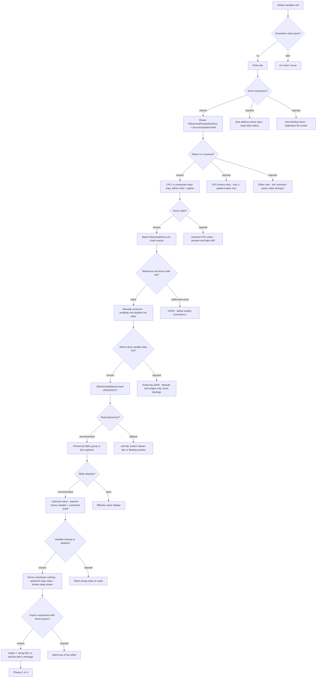
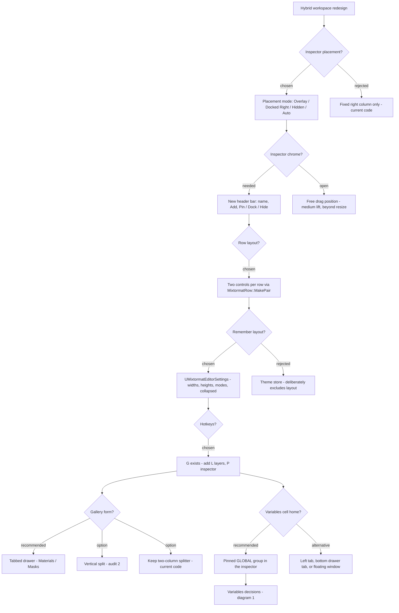
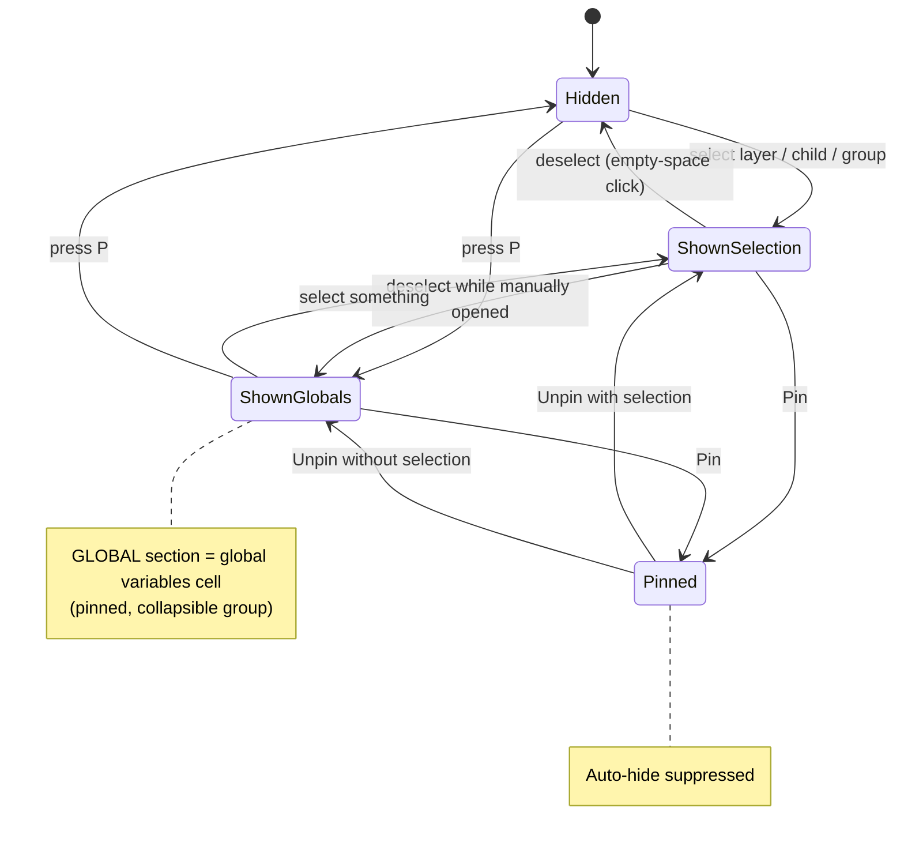
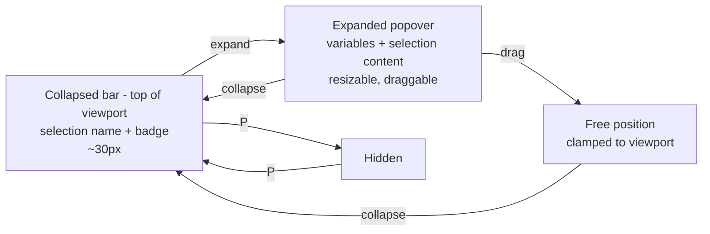

# Mermaid Diagrams

Decision flowcharts and state models for the workspace-layout and
global-variables work. See `decisions-log.md` for the same content as tables.

## 1. Global variables — decision flow

## 2. Hybrid workspace — reconciliation flow

## 3. Inspector visibility state model (Auto mode)

## 4. Inspector popover — collapse-to-top states

