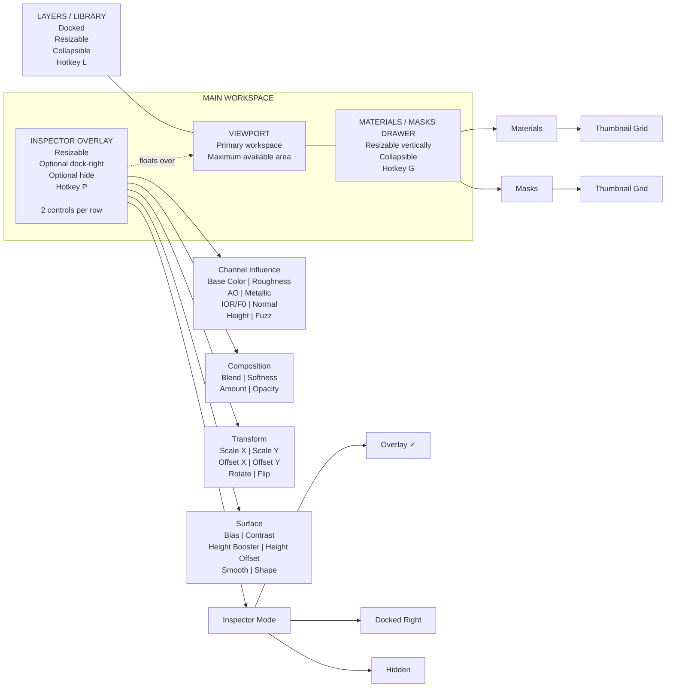
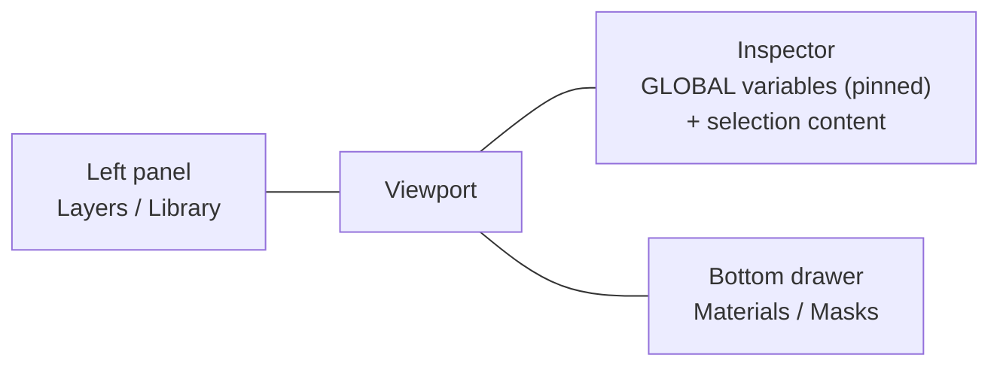

# Mixtormat Mermaid Layout Concepts

## 1. Recommended Hybrid Workspace Architecture

```mermaid
flowchart TB

%% =========================================================
%% MIXTORMAT — RECOMMENDED HYBRID WORKSPACE ARCHITECTURE
%% =========================================================

APP["Mixtormat Editor"]

APP --> TOP["Top Toolbar"]
APP --> BODY["Authoring Workspace"]
APP --> STATUS["Status Bar"]

%% =========================================================
%% TOP TOOLBAR
%% =========================================================

TOP --> FILE["File / Edit / Window / Tools / Help"]
TOP --> DOC["Untitled Mixtormat Material"]
TOP --> ACTIONS["New / Load / Save / Save As"]
TOP --> UI["UI Style"]
TOP --> DOCS["Docs"]
TOP --> SETTINGS["Settings"]

%% =========================================================
%% MAIN WORKSPACE
%% =========================================================

BODY --> LEFT["Left Panel"]
BODY --> CENTER["Center Workspace"]

%% =========================================================
%% LEFT PANEL
%% =========================================================

LEFT --> LEFT_TABS["Tabs"]
LEFT_TABS --> LAYERS["Layers"]
LEFT_TABS --> LIBRARY["Library"]

LAYERS --> TREE["Layer Hierarchy"]

TREE --> GEN["Generator Layer"]
GEN --> CRACKS["Cracks"]

TREE --> FINE["Fine - Raw"]

TREE --> MAT["Limestone - Charcoal"]
MAT --> IDS["Surface IDs"]
MAT --> WORN["Worn Edges"]
WORN --> MASK_REF["TX_Masks_Grunge"]

LEFT --> LEFT_BEHAVIOR["Panel Behavior"]

LEFT_BEHAVIOR --> LEFT_RESIZE["Horizontal Resize"]
LEFT_BEHAVIOR --> LEFT_COLLAPSE["Collapse / Expand"]
LEFT_BEHAVIOR --> LEFT_REMEMBER["Remember Width"]
LEFT_BEHAVIOR --> LEFT_HOTKEY["Hotkey: L"]

%% =========================================================
%% CENTER WORKSPACE
%% =========================================================

CENTER --> VIEWPORT["Viewport"]
CENTER --> GALLERY["Bottom Gallery Drawer"]

%% =========================================================
%% VIEWPORT
%% =========================================================

VIEWPORT --> PREVIEW["Material Preview"]
PREVIEW --> SPHERE["Limestone / Charcoal Sphere"]

VIEWPORT --> VIEW_TOP["Top Viewport Controls"]
VIEW_TOP --> AA["FXAA / TSR"]
VIEW_TOP --> SCALE["Scale"]
VIEW_TOP --> RENDER["Default / Lumen / Final"]

VIEWPORT --> VIEW_LEFT["Left Viewport Tool Strip"]
VIEW_LEFT --> LIGHT["Lighting"]
VIEW_LEFT --> ENV["Environment"]
VIEW_LEFT --> OBJECT["Preview Object"]
VIEW_LEFT --> WORLD["World / Orientation"]
VIEW_LEFT --> RESET["Reset / Refresh"]

VIEWPORT --> VIEW_BOTTOM["Bottom Viewport Controls"]
VIEW_BOTTOM --> DISP["Displacement"]
DISP --> DISP_AMOUNT["Amount"]
DISP --> DISP_LIGHT["Light"]
DISP --> DISP_SKY["Skylight"]

VIEW_BOTTOM --> FOV["FOV"]
VIEW_BOTTOM --> RES["1K / 2K / 4K"]

%% =========================================================
%% INSPECTOR PLACEMENT MODEL
%% =========================================================

VIEWPORT --> INSPECTOR["Inspector"]

INSPECTOR --> MODE["Placement Mode"]

MODE --> OVERLAY["Overlay"]
MODE --> DOCKED["Docked Right"]
MODE --> HIDDEN["Hidden"]

OVERLAY --> OVERLAY_PROPS["Overlay Behavior"]
OVERLAY_PROPS --> OVERLAY_RESIZE["Resize from Left Edge"]
OVERLAY_PROPS --> OVERLAY_MOVE["Optional Drag Position"]
OVERLAY_PROPS --> OVERLAY_PIN["Pin"]
OVERLAY_PROPS --> OVERLAY_DOCK["Dock"]
OVERLAY_PROPS --> OVERLAY_CLOSE["Collapse / Hide"]

INSPECTOR --> INSPECTOR_HOTKEY["Hotkey: P"]
INSPECTOR --> INSPECTOR_STATE["Remember Width + Placement Mode"]

%% =========================================================
%% INSPECTOR CONTENT
%% =========================================================

INSPECTOR --> HEADER["Inspector Header"]
HEADER --> MATERIAL_NAME["Limestone - Charcoal"]
HEADER --> MATERIAL_TYPE["LIMESTONE · CHARCOAL"]
HEADER --> ADD["Add"]
HEADER --> INSPECTOR_ACTIONS["Pin / Dock / Hide"]

INSPECTOR --> CHANNEL["Channel Influence"]
INSPECTOR --> COMPOSITION["Composition"]
INSPECTOR --> BLEND["Blending / Opacity"]
INSPECTOR --> COLOR["Color"]
INSPECTOR --> TRANSFORM["Surface Adjustments"]
INSPECTOR --> ROUGHNESS["Roughness"]
INSPECTOR --> RELIEF["Relief"]
INSPECTOR --> FEATURED["Featured Masks"]

%% =========================================================
%% TWO-CONTROLS-PER-ROW INSPECTOR LAYOUT
%% =========================================================

CHANNEL --> CH_ROW1["Base Color   |   Roughness"]
CHANNEL --> CH_ROW2["Ambient Occlusion   |   Metallic"]
CHANNEL --> CH_ROW3["IOR / F0   |   Normal"]
CHANNEL --> CH_ROW4["Height   |   Fuzz"]

COMPOSITION --> COMP_ROW1["Blend Mode   |   Softness"]
COMPOSITION --> COMP_ROW2["Amount   |   Opacity"]

BLEND --> BLEND_MODE["Blend Mode"]
BLEND --> BLEND_ROW1["Amount   |   Coat"]
BLEND --> BLEND_ROW2["Opacity   |   Coat Amount"]

COLOR --> COLOR_ROW1["Hue Shift   |   Saturation"]
COLOR --> COLOR_ROW2["Value   |   Contrast"]

TRANSFORM --> TRANS_ROW1["Scale X   |   Scale Y"]
TRANSFORM --> TRANS_ROW2["Offset X   |   Offset Y"]
TRANSFORM --> TRANS_ROW3["Rotate   |   Flip U / Flip V"]

ROUGHNESS --> ROUGH_ROW1["Bias   |   Contrast"]
ROUGHNESS --> ROUGH_ROW2["Offset   |   Range"]

RELIEF --> RELIEF_ROW1["Height Booster   |   Height Offset"]
RELIEF --> RELIEF_ROW2["Height Smooth   |   Height Shape"]

FEATURED --> FEATURE_ROW1["Normal Influence   |   Cavity to Convex"]
FEATURED --> FEATURE_ROW2["Radius   |   Smoothing"]
FEATURED --> FEATURE_ROW3["Strength   |   Power"]
FEATURED --> FEATURE_ROW4["Height   |   AO"]

%% =========================================================
%% BOTTOM GALLERY DRAWER
%% =========================================================

GALLERY --> GALLERY_HEADER["Gallery Header"]
GALLERY_HEADER --> MATERIAL_TAB["Materials"]
GALLERY_HEADER --> MASK_TAB["Masks"]

GALLERY --> GALLERY_SEARCH["Search / Filter"]
GALLERY_SEARCH --> SEARCH["Search Materials"]
GALLERY_SEARCH --> FILTER["All Materials"]

GALLERY --> CONTENT["Gallery Content"]
CONTENT --> MATERIAL_GRID["Material Thumbnails"]
CONTENT --> MASK_GRID["Mask Thumbnails"]

GALLERY --> GALLERY_BEHAVIOR["Drawer Behavior"]
GALLERY_BEHAVIOR --> GALLERY_RESIZE["Vertical Resize"]
GALLERY_BEHAVIOR --> GALLERY_COLLAPSE["Collapse / Expand"]
GALLERY_BEHAVIOR --> GALLERY_REMEMBER["Remember Height"]
GALLERY_BEHAVIOR --> GALLERY_HOTKEY["Hotkey: G"]

%% =========================================================
%% LAYOUT STATE / PERSISTENCE
%% =========================================================

APP --> LAYOUT_STATE["Layout State"]

LAYOUT_STATE --> LS_LEFT["Left Panel Width"]
LAYOUT_STATE --> LS_INSPECTOR["Inspector Width"]
LAYOUT_STATE --> LS_INSPECTOR_MODE["Inspector Placement"]
LAYOUT_STATE --> LS_GALLERY["Gallery Height"]
LAYOUT_STATE --> LS_LEFT_COLLAPSED["Layers Collapsed"]
LAYOUT_STATE --> LS_INSPECTOR_COLLAPSED["Inspector Hidden / Visible"]
LAYOUT_STATE --> LS_GALLERY_COLLAPSED["Gallery Collapsed"]

LAYOUT_STATE --> SETTINGS_STORE["UMixtormatEditorSettings"]

%% =========================================================
%% QUICK ACCESS
%% =========================================================

APP --> HOTKEYS["Quick Access"]

HOTKEYS --> HK_L["L = Layers"]
HOTKEYS --> HK_P["P = Inspector"]
HOTKEYS --> HK_G["G = Gallery"]

%% =========================================================
%% PRIMARY DESIGN GOAL
%% =========================================================

APP --> GOAL["Primary Goal"]
GOAL --> VIEWPORT_PRIORITY["Viewport gets maximum space"]
GOAL --> LESS_CHROME["Reduce permanent UI chrome"]
GOAL --> BETTER_INSPECTOR["Shorter / wider Inspector"]
GOAL --> EASY_ACCESS["Panels remain one action away"]
```

## 2. Screen Layout Diagram

## 3. Inspector Two-Controls-Per-Row Diagram

```mermaid
flowchart TB

INSPECTOR["Inspector"]

INSPECTOR --> CHANNEL["CHANNEL INFLUENCE"]

CHANNEL --> C1["Base Color ┃ Roughness"]
CHANNEL --> C2["Ambient Occlusion ┃ Metallic"]
CHANNEL --> C3["IOR / F0 ┃ Normal"]
CHANNEL --> C4["Height ┃ Fuzz"]

INSPECTOR --> COMP["COMPOSITION"]

COMP --> CO1["Blend Mode ┃ Softness"]
COMP --> CO2["Amount ┃ Opacity"]

INSPECTOR --> BLEND["BLENDING / OPACITY"]

BLEND --> B1["Blend Mode ┃ Amount"]
BLEND --> B2["Opacity ┃ Coat Amount"]

INSPECTOR --> COLOR["COLOR"]

COLOR --> CL1["Hue Shift ┃ Saturation"]
COLOR --> CL2["Value ┃ Contrast"]

INSPECTOR --> TRANSFORM["SURFACE ADJUSTMENTS"]

TRANSFORM --> T1["Scale X ┃ Scale Y"]
TRANSFORM --> T2["Offset X ┃ Offset Y"]
TRANSFORM --> T3["Rotate ┃ Flip U / Flip V"]

INSPECTOR --> ROUGH["ROUGHNESS"]

ROUGH --> R1["Bias ┃ Contrast"]
ROUGH --> R2["Offset ┃ Range"]

INSPECTOR --> RELIEF["RELIEF"]

RELIEF --> RL1["Height Booster ┃ Height Offset"]
RELIEF --> RL2["Height Smooth ┃ Height Shape"]

INSPECTOR --> MASKS["FEATURED MASKS"]

MASKS --> M1["Normal Influence ┃ Cavity to Convex"]
MASKS --> M2["Radius ┃ Smoothing"]
MASKS --> M3["Strength ┃ Power"]
MASKS --> M4["Height ┃ AO"]
```

---

# Reconciliation with the codebase

Added during the workspace-layout review. Verified against source; see
`decisions-log.md` and `inspector-placement-model.md` for the full context.

## Agrees with verified architecture

- Inspector Overlay / Docked / Hidden = audit §6 option B (reparent the single
  instance in `BuildWorkspaceUI`).
- Persistence in `UMixtormatEditorSettings` — matches the audit; no layout
  store exists today.
- Hotkeys: `G` exists (`SMixtormat.cpp` L565); `L` and `P` are free.
- Two controls per row: `MixtormatRow::MakePair` already supports this;
  partially exists in the inspector today.

## New, not yet in any plan

- Inspector **header bar** (name, Add, Pin/Dock/Hide) — none exists today;
  `BuildInspectorPanel` returns a bare `SBox`.
- Inspector **free drag position** + Pin — beyond the audit's resize handle;
  assessed medium (see `inspector-placement-model.md`).
- **Auto** placement mode: overlay shown on selection, hidden otherwise, with
  a `P` manual toggle and Pin suppressing auto-hide.
- **Collapse-to-top**: the popover collapses to a ~30px bar at the top of the
  viewport; the identity row (name + badge) already works as that bar.

## Conflicts to resolve

- This document shows the gallery as a **tabbed drawer** (Materials / Masks
tabs); current code is a two-column splitter, and the audit proposed a
vertical split — three competing resolutions. Recommendation: tabs.
- This document omits the **VARIABLES cell** entirely. Recommendation: the
inspector's existing GLOBAL placeholder section (shown when nothing is
selected, currently "No global settings yet.") becomes the variables cell,
pinned and collapsible so it coexists with selection content.

## Where the variables cell fits

